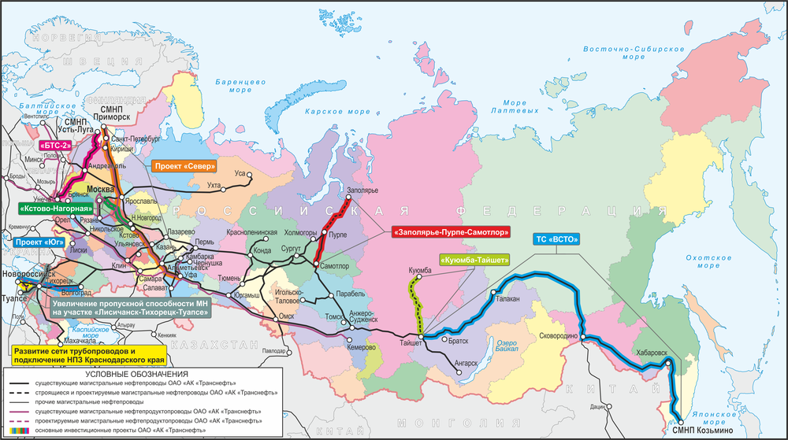
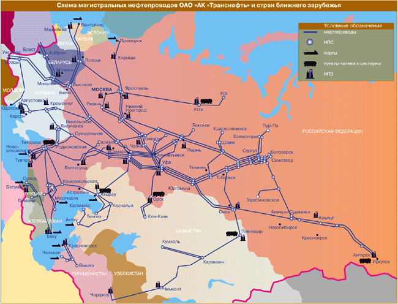

 [ REFINERY](https://github.com/soda-io/REFINERY)
===

### == ФОН ==
На создание этого проекта нас побудила отстуствие структурированных данных по России. Мы надеемся, что в дальнейшем заинтересованные люди будут использовать эту информацию для своих проектов и не тратить на поиски подобной информации огромное кол-во времени, усилий и средств.

### == ЦЕЛЬ ==
Создать датасеты с открытыми данными НПЗ России, API и мобильное приложение.

### == МЕТОДЫ ==
Поиск информации; сбор информации; класификация информации; структурирование информации в машиночитаемый вид.

### Что нас побудило

На создания проекта нас побудило отсутствие открытых данных по НПЗ России и энергетике в целом. Мы собрали информацию по всем НПЗ России в одном месте и уверены, что в дальнейшем все желающие смогут использовать эти данные для своих проектов а не тратить свое время, усилия и средства на поиск информации об НПЗ. 

### Ход работы

- Поиск информации 
- Cбор информации 
- Класификация информации 
- Структурирование информации в машиночитаемый вид

# Данные по НПЗ России


# Ачинский НПЗ
Ачинский НПЗ является единственным крупным нефтеперерабатывающим предприятием в Красноярском крае, а также играет важную роль на рынке нефтепродуктов прилегающих регионов.
## История
Строительство завода началось в 1972 году. Первую продукцию АНПЗ произвёл 12 декабря 1982 года. Процедура акционирования проведена в мае 1993 года.
## На сегодня 
Завод перерабатывает западносибирскую нефть, поставляемую по системе трубопроводов АК «Транснефть». Вторичные перерабатывающие мощности завода включают установки каталитического риформинга, гидрокрекинга, замедленного коксования, изомеризации, гидроочистки реактивного и дизельного топлива, битумную и газофракционную установки. В 2012 г. на Ачинском НПЗ было переработано 7,4 млн т нефти и произведено 7,2 млн т товарной продукции. Глубина переработки составила 61,3 %. Благодаря введенной в эксплуатацию в декабре 2007 г. установке изомеризации Ачинский НПЗ производит самый большой среди НПЗ «Рос нефти» объем автобензина, соответствующего классам 3 и 4.По итогам интегрального рейтинга за 2013 год Ачинский НПЗ признан наиболее эффективным нефтеперерабатывающим заводом компании «Роснефть». 
## Продукция
Ачинский НПЗ производит более 100 наименований нефтепродуктов. Продукция завода реализуется преимущественно на территории Красноярского края и соседних регионов.
- Битум
- Дизельное Топливо
- Мазут Топочный
- Нефрас
- Пиролизное сырьё для нефтехимии
- Реактивное топливо
- Сжиженый газ
- Бензин

## Руководители
Генеральный деректор - Кинзуль Александр Петрович

"Роснефть"

#Афипский нефтеперерабатывающий завод

В настоящее время специализацией нефтеперерабатывающего завода является выпуск бензина экспортного технологического марки П1, дизельного топлива марки Л-0,2-62 для поставок на экспорт, мазута топочного малозольного II вида марки М-40 , в соответствии с требованиями нормативно-технической документации на данную продукцию. Афипский нефтеперерабатывающий завод является одним из самых крупных нефтеперерабатывающих заводов на юге России. Численность сотрудников на заводе составляет более 1000 человек.

Головной офис «Афипского НПЗ» находится пгт. Афипский. В 2006 году предприятие стало крупным активом компании «Базовый элемент» (подразделения «Объединенная нефтяная группа»), сделавшим крупные финансовые вложения в развитие завода. В 2010 году владельцем 100% доли уставного капитала завода стала компания «Нефтегазиндустрия», которая продолжает инвестирование завода. 

#История


1952

Принято решение построить в поселке Афипский газобензиновый  завод. Проектирование  завода с мощностью по переработке 438 млн. м  попутного нефтяного газа в год было поручено Московскому институту «Гипрогазтоппром».
1960

Работы нулевого цикла и основные строительные конструкции были выполнены. В связи с отсутствием оборудования для продолжения строительства, Краснодарский Совнархоз принял решение о консервации строительства Афипского завода.
1962

Решающую роль в судьбе завода сыграло Постановление ЦК КПСС и Совета Министров СССР «Об ускорении строительства газобензиновых заводов», принятое в 1962 году. Благодаря этому постановлению строительство завода возобновилось. 
1963

К этому времени в Краснодарском крае большое развитие получила газовая индустрия. Был открыт ряд крупных газоконденсатных месторождений: Каневское, Березанское, Ленинградское, Майкопское и ряд других. 31 декабря 1963 года был подписан акт ввода в эксплуатацию первой очереди Афипского газобензинового завода.
1964

Началась переработка газоконденсатов Краснодарского края с получением бензина А-66 и дизельного топлива.

Была введена в эксплуатацию установка совместной переработки газа и газоконденсата СПГК с блоком газофракционирования (ГФУ).
1970

В августе были введены в строй две технологические установки - установка вторичной перегонки – 22/4 и установка каталитического риформинга Л-35/12-300"А”.

Введен в эксплуатацию цех резервуарных парков, перекачек и коммуникаций для нефтепродуктов и сжиженного газа, эстакада по сливу и наливу нефтепродуктов и реагентное хозяйство, а также очистные сооружения для приема и очистки промышленных и хозяйственно-бытовых сточных вод завода и поселка.
1975

Была введена в эксплуатацию вторая установка каталитического риформинга Л-35/13-300"А”.
1978

Введена в эксплуатацию установка диметилирования толуола.
1980

В январе было создано производственное объединение «Краснодарнефтеоргсинтез».

В объединение вошли три завода:

    Краснодарская топливная площадка, действующая с 1911 г.,
    Туапсинский нефтеперерабатывающий завод, действующий с 1929 года,
    Афипский нефтеперерабатывающий завод, действующий с 1963 г., который являлся головным предприятием объединения.


1983

Введено в эксплуатацию факельное хозяйство с целью утилизации сбросных нефтепродуктов от технических установок, топливного узла, емкостей сжиженного газа с ЦРППиК.

1994

В мае предприятие акционировалось и стало акционерным обществом открытого типа - АООТ «Краснодарнефтеоргсинтез».

1996

В мае АООТ «Краснодарнефтеоргсинтез» было переименовано в ОАО «Роснефть -Краснодарнефтеоргсинтез».

2003

В июле предприятие было переименовано в ООО "Афипский НПЗ".

1 октября на завод впервые поступила нефть по новому нефтепроводу.

2005

Завершена третья очередь газопровода, модернизирована сливо-наливная эстакада, произведен капитальный ремонт установок 22/4 и СПГК, завершена реконструкция резервуарных парков под нефть и нефтепродукты.

2006

Афипский НПЗ вошел в состав «Объединенной нефтяной группы» (нефтегазовое подразделение компании «Базовый элемент»), которое сделало серьезные финансовые вложения в реконструкцию и развитие предприятия: введен в эксплуатацию блок подготовки реактивного топлива, проведена реконструкция эстакады сжиженного газа для осуществления отгрузки керосина и бензина. 

2008

ООО «Афипский НПЗ» прошел сертификацию международных систем менеджмента, качества, экологии и охраны труда. Завершено строительство дополнительных железнодорожных путей, в результате которого общая протяженность парка составила более 9 км.

2010

В июне «Афипский НПЗ» стал дочерней компанией "Нефтегазиндустрия", которая продолжает осуществлять на заводе инвестиционную программу, направленную на увеличение объемов и глубины переработки, а также на переход к переработке нефти марки Urals.

2011

Завершена реконструкция установки СПГК, введен в эксплуатацию печной блок П-1, что позволило увеличить мощность завода до 5 млн. тонн в год. Завершена реконструкция ж/д парка, в результате которой общая протяженность подъездного пути необщего пользования увеличилась до 13,5 км.

2012

Приступили к строительству сливо-наливной эстакады.  

2013

Ввели в эксплуатацию: 11 марта – блок оборотного водоснабжения, с 30 июля – приемо-сдаточный пункт сырья по трубопроводу.

Сегодня на АНПЗ ударными темпами идет реконструкция и модернизация технологического и производственного оборудования. Сделан важный шаг в наращивании производственного потенциала. 

##Руководство

Генеральный директор
Сюткин Сергей Николаевич

##Перспективы развития

В 2012 году предприятие прошло ресертификацию интегрированной системы менеджмента (ИСМ), отвечающей требованиям одновременно трех международных стандартов: ИСО 9001 по качеству, ИСО 14001 по охране окружающей среды и OHSAS 18001 по охране здоровья и безопасности труда. На ООО «Афипский НПЗ» регулярно проводится ремонт и модернизация оборудования, что способствует снижению нагрузки предприятия на окружающую среду.

Компанией ООО “Нефтегазиндустрия” определены основные направления развития АНПЗ на ближайшие годы: увеличение объемов переработки, снижение потерь, увеличение ассортимента выпускаемой продукции. Перед нашим заводом поставлены задачи производить дизельное топливо, отвечающее нормам Евро-5 в отношении экологического класса.

В ближайшее время будут построены новые технологические объекты:

    комбинированная установка вакуумной перегонки мазута и висбрекинга гудрона – в 2015 г.;
    комплекс гидроочистки дизельного топлива – в 2016 г.;
    установка получения элементарной серы – в 2016 г.;
    комплекс гидрокрекинга – в 2017 г.

# Ангарский НПЗ
ОАО «Ангарская нефтехимическая компания» (АНХК) — одно из крупнейших предприятий города Ангарска Иркутской области, включающее в себя непосредственно сам нефтеперерабатывающий завод, химический завод, завод масел и др.
Предприятие основано в 1955 году.
В 2007 году компания заняла 129-е место в списке крупнейших российских компаний.
Сегодня компания выпускает свыше 200 видов продукции, что составляет 15 % валового продукта Иркутской области. В производственный цикл компании интегрированы предприятия Саянска и Усолья-Сибирского, которые связаны с компанией трубопроводами. По ним они получают необходимое сырье — этилен и пропилен от Ангарского завода полимеров.
## История
В конце 1940-х годов на территории между Усольем-Сибирским и Иркутском у устья реки Китой было решено построить предприятие Комбинат-16. Такое название получил тогда нынешний АНХК. Постановление правительства о создании комбината искусственного жидкого топлива было принято в сентябре 1945 года. Приказ о создании комбината был подписан Лаврентием Берией в 1947 году. Доставка оборудования осуществлялась по Транссибирской магистрали.
5 августа 1960 года была произведена первая продукция завода. Через 6 дней после пуска предприятие заработало на полную мощность. Строительство при этом продолжалось. В 1974 году открывается производство стирола, в 1976 вводится комплекс производства этилен-пропилен-60, в 1977 — производство этилбензола, в 1978 — производство по выпуску полиэтилена высокого давления. В 1982 году введён в эксплуатацию комплекс производства этилен-пропилен-300 и бензола, что позволило увеличить выпуск полиэтилена и по трубопроводу начать подачу этилена на Зиминский химический комбинат для производства поливинилхлорида. Завод отказывается от ввоза бензола со стороны и полностью переходит на самостоятельный выпуск этилбензола и стирола. В1985 году впервые в стране освоено производство дициклопентадиена на основе нефтехимического сырья. В 1987 году вводится в эксплуатацию установка по производству пара высокого давления «Энергоблок».
После развала Советского союза предприятие уменьшило свою мощность, и для него начался сложный период. С конца 1990-х годов компания принадлежала СИДАНКО. После процедуры банкротства, в 1999 году контрольный пакет акций АНХК приобрела группа РИНКО. РИНКО привлекла в качестве стратегического партнера ЮКОС, который вскоре выкупил долю РИНКО в комбинате. Потом ЮКОС полностью поглотил АНХК, обменяв акции миноритариев на собственные бумаги. С 2001 года АНХК стала структурным подразделением НК «ЮКОС». После объявления банкротства ЮКОСа в мае 2007 года Ангарская нефтехимическая компания вошла в состав государственной нефтяной компании «Роснефть».
С 2007 года в компании производится полная реконструкция всех производственных линий завода для соответствия продукции стандартам качества Евро-2 и Евро-3. В 2011 году на Нефтеперерабатывающем заводе введён в эксплуатацию комплекс изомеризации нафты, что позволило увеличить производство автомобильного бензина с улучшенными эксплуатационными характеристиками.
## На сегодняшний день
С 2013 год на НПЗ ОАО «АНХК» налажено производство автомобильного топлива в соответствии с экологическими стандартами Евро-3, Евро- и Евро-5.
Мощность НПЗ составляет 11 млн т (80,5 млн барр.) нефти в год. Завод перерабатывает западносибирскую нефть, поставляемую по системе трубопроводов АК «Транснефть». Вторичные перерабатывающие мощности завода включают установки изомеризации, гидроочистки бензинов и дизельного топлива, алкилирования, битумную установку. Благодаря значительной доле вторичных процессов Ангарский завод выпускает более 200 наименований продукции, в том числе бензин, дизельное топливо, топливо для реактивных двигателей, различные марки битума, кокса, масел.
Ангарский НПЗ ежегодно поставляет 600–700 тыс. т прямогонного бензина в качестве сырья для установки пиролиза Ангарского завода полимеров (нефтехимический блок Ангарского НПЗ), который выпускает широкую номенклатуру нефтехимической продукции и входит в операционную структуру НК «Роснефть».
## Модернизация
В 2012 г. на Ангарской НХК было переработано 10,1 млн т нефти, что на 2,5 % больше показателя 2011 г. На заводе было произведено 9,3 млн т товарной продукции (с учетом продукции Ангарского завода полимеров) при глубине переработки 73,1 %. Продолжалась работа по реализации комплексной программы модернизации, направленной на выполнение требований Технического регламента. В рамках этой программы завершено строительство станции смешения бензинов. Реализация данного проекта позволила оптимизировать производство бензинов.
## Руководители
- "Роснефть"
- Руководитель - Сердюк Ф.И.

# Антипинский НПЗ

ЗАО «Антипинский НПЗ» располагается в промышленной зоне г. Тюмени на юго-востоке вблизи поселка Антипино.

В области сосредоточена основная часть российских запасов нефти (72%) и природного газа (91%). Однако, несмотря на то, что Тюменская область относится к числу крупнейших нефтедобывающих регионов, она вынуждена завозить светлые нефтепродукты из других регионов в объеме около 1,2 млн.тонн, в частности, с Омского НПЗ (550 км от Тюмени), Уфимского НПЗ (800 км) и Пермьнефтеоргсинтез (600 км).

В связи с этим строительство на территории области собственного НПЗ абсолютно логично.

Также в свете борьбы с мини-НПЗ, выпускающими некондиционное топливо, особенно актуально строительство современного НПЗ с новыми технологиями, позволяющими поставлять на рынок качественные нефтепродукты в необходимом количестве.

4 ноября 2006 г. получено разрешение администрации города Тюмени на ввод в эксплуатацию I очереди строительства ЗАО «Антипинский НПЗ» проектной мощностью 400 тыс. тонн в год по перерабатываемой нефти. По состоянию на
2008 г. в результате технического перевооружения фактическая мощность I очереди составила 740 тыс. тонн в год.

9 апреля 2010 г. получено разрешение администрации города Тюмени на ввод в эксплуатацию II очереди проектной мощностью 2,75 млн. тонн в год. После модернизации второй очереди, с ноября 2012 г. мощность 2 очереди составляет
3,5 млн. тонн в год. С нового года завод будет переведен на работу с эквивалентом 
4 млн. 200 тыс. тонн в год. Предприятие подобной мощности не вводилось на территории РФ последние 30 лет.

За 2011 год было произведено 2,604 млн. тонн продукции, кроме того 336 тыс. тонн были добыты и потреблены с месторождения компании-партнера ООО «Тарховское». Итого в сумме: 2,94 млн.тонн товарооборота на 2 млрд. долл. собственных продаж.

За 2012 год объем переработки на Антипинском НПЗ равен уже более 2,9 млн. тонн нефти, из которых 345 тыс. тонн. - с месторождения компании-партнера ООО «Тарховское». Таким образом, товарооборот за 2012 год составил 3,245 млн. тонн.

Уникальность Антипинского НПЗ в том, что это частный, а не государственный проект, мощность которого достигнет 7,5 млн тонн в год (2013 г.), качество нефтепродуктов будет соответствовать стандарту Евро-5 (2014 г.), а глубина переработки увеличится до 94% (2015 г.)

Конкурентные преимущества Антипинского НПЗ:
- АНПЗ – единственный промышленный НПЗ в регионе и Уральском федеральном округе;
- АНПЗ выгодно расположен, находясь вблизи развитой логистической сети: ж/д инфраструктура, автоинфраструктура;
- АНПЗ подключен к магистральным нефтепроводом АК «Транснефть» общей мощностью 6 млн тонн в год, с учетом развития предприятия, включая третью очередь;
- Тюменский регион отличается высоким спросом на нефтепродукты. Более того, АНПЗ имеет возможность отпускать предприятиям топливо прямо с завода путем автоналива, небольшими бензовозами 5-30 тонн. Таким образом, достигается экономия за счет способа отгрузки продукции небольшими объемами.


# Астраханский ГПЗ

Астраханский ГПЗ был основан в 1981 г. 
На данный момент он осуществляет переработку пластового газа, газового 
конденсата и нефти с получением широкого ассортимента товарной продукции.

## История

**Переместить часть информации в этот блок.**

[Ссылка](http://iom.invensys.com/RU/Documents/LocalArticles/%D0%90%D1%81%D1%82%D1%80%D0%B0%D1%85%D0%B0%D0%BD%D1%81%D0%BA%D0%B8%D0%B9-%D0%93%D0%9F%D0%97_invensys_%D0%AD%D0%BA%D1%81%D0%BF%D0%B5%D1%80%D1%82-%D0%9E%D0%B1%D0%BE%D1%80%D1%83%D0%B4%D0%BE%D0%B2%D0%B0%D0%BD%D0%B8%D0%B5-6.2012.pdf)

## Сегодня

- добыча и переработка газа 9,8 млрд. м3 в год 
- производство серы 3,8 млн. т., 
- бензин 856 тыс. т., 
- дизтопливо 718 тыс. т., 
- мазут 374 тыс. т.,
- сжиженный газ 240 тыс. т.

## Модернизации

**Переместить часть информации в этот блок.**

http://sdelanounas.ru/blogs/42996/

## Руководители

"Газпром"
Руководитель компании:	Белинский Борис Исаевич

# Бакинский НПЗ
Бакинский нефтеперерабатывающий завод имени Гейдара Алиева (БНПЗ) — один из крупнейших нефтеперерабатывающих предприятий Закавказского региона, был основан в конце 1940-х. Входит в структуру Государственной нефтяной компании Азербайджанской Республики
## Добыча
Производительность завода находится в пределах 4,0-6,0 млн т/год, с перспективой увеличения до 10,0 млн т/год.
## История
В эти годы, в связи с дефицитом высококачественных автомобильных бензинов в бывшем Советском Союзе, по решению Министерства нефтяной промышленности СССР в Баку развернулось строительство комплекса установок каталитического крекинга.

Первые технологические установки были сданы в эксплуатацию уже через несколько лет после принятия этого решения, а 29 июля 1953 года был издан приказ Министерства нефтяной промышленности СССР о создании Нового Бакинского нефтеперерабатывающего завода (НБНЗ).

С первых же дней после своего создания Новый Бакинский нефтеперерабатывающий завод привлек внимание не только технических и научных кругов республиканского и союзного масштаба, но и широких слоев мировой общественности. Так, только в течение 1956-1957 г.г. завод посетили около 50 авторитетных зарубежных делегаций.

За истекшие десятилетия Новый Бакинский нефтеперерабатывающий завод постоянно обновлялся, расширялся, а коллектив завода за ударный труд более 80 раз был награжден Переходящим Красным Знаменем союзного и республиканского министерств нефтеперерабатывающей и нефтехимической промышленности.

Коллектив Нового Бакинского нефтеперерабатывающего завода постоянно отличался своей преданностью славным традициям стать лидером нефтеперерабатывающей промышленности республики. Вопросы обеспечения высокой производительности труда, качества выпускаемой продукции, повышения экономической эффективности труда всегда были на первых планах нефтепереработчиков.

Трудолюбие и высокий интеллектуальный уровень инженерно-технического персонала и работников Новый Бакинский нефтеперерабатывающий завод были широко признаны. Всюду и все называли этот завод флагманом нефтепереработки.
## Производство
Здесь производятся 15 наименований нефтепродуктов, в том числе автомобильные бензины, авиационный керосин, дизельное топливо, мазут, нефтяной кокс и т.д.
## На сегодня
Сегодня Бакинский нефтеперерабатывающий завод имени Гейдара Алиева полностью обеспечивает потребность республики на нефтепродуктах. Кроме того, более 70% производимых здесь светлых нефтепродуктов экспортируется в зарубежные страны, в том числе во Францию, Италию, Испанию, Израиль, Россию, Иран, Грузию, Грецию и другие страны.

#Белоглинский НПЗ

Точной информации нет, так как НПЗ с 2008 года находится в стадии ликвидации.
#Ликвидатор:
- МИРОШНИЧЕНКО ТАТЬЯНА БОРИСОВНА 

#Ильский нефтеперерабатывающий завод

Нефтеперерабатывающее предприятие в Краснодарском крае. Входит в состав Кубанской нефтегазовой компании.
Ильский НПЗ располагается в поселке Ильский Северского района Краснодарского края, в 50 километрах от Краснодара. Площадь производственной площадки завода составляет 72 гектара.

##История

Ильский НПЗ создан на основе существовавшего ранее на месте предприятия мини-НПЗ. В 2001 году было принято решение о перепрофилировании предприятия в НПЗ средних размеров. Строительство первой очереди завершилось в следующем году. По итогам 2002 годы на предприятии было произведено 35 тыс. тонн прямогонного бензина и дизельного топлива. В 2006 году начато строительство второй очереди завода. В 2008 году НПЗ переработал 380 тыс. тонн нефти. После окончания строительства третьей линии по переработке нефти в июне 2009 года мощности по переработке составили 750 000 тонн нефти в год.

В августе 2010 года была запущена четвертая линия переработки нефти, общая мощность завода по переработке превысила 1 млн. тонн в год. По итогам 2010 года объем переработки нефти составил 800 тыс. тонн. В 2010 году в развитие завода было вложено 368 млн. руб.

##Перспективы развития

Согласно программе технического перевооружения предприятия до 2015 года мощность по переработке нефти должна быть доведена до 3,5 млн. тонн в год с освоением производства дизельного топлива класса ЕВРО-5 и увеличением глубины переработки нефти до 90%.

##Руководство

Генеральный директор - Тагиров Андрей Валерьевич

Главный бухгалтер - Елина Светлана Евгеньевна

Заместитель генерального директора правовой, административной и корпоративной работе - Московченко Дмитрий Владимирович

Заместитель главного инженера по путевому хозяйству и логистике - Никкеров Александр Александрович

Заместитель главного инженера - Ланцов Борис Николаевич

Заместитель главного инженера по производству - Кузьменко Сергей Александрович

Заместитель главного инженера по АСУ ТП - Юнев Юрий Александрович

#Камарчанский НПЗ

Шигин подчеркнул, что строительство завода началось в июне 2004 года,
а пробный запуск состоится 10 июля. Директор поделился планами о том,
что после пробного запуска завод будет достраиваться и сдаваться госкомиссии.

#Производительность

Предполагается, что предприятие будет перерабатывать 50 тысяч тонн нефти в год.
Расчетная стоимость первой очереди проекта составляет порядка 82 млн. рублей.
Планируется строительство второй очереди такой же мощности. 
Планируемый выход продукции распределяется следующим образом:
- дизельное топливо - 32%, 
- прямогонный бензин - 28 %,
- мазут - 36% и газ - 4%.
(На момент(приблизительно) 2005 года)

##Руководство
Генеральный директор - Василий Шигин

##P.S.

(На момент(приблизительно) 2005 года)

# Когалымский НПЗ

ТПП «Когалымнефтегаз» — самое крупное территориально-производственное предприятие ООО «ЛУКОЙЛ-Западная Сибирь». В его состав входят 3 центральные инженерно-технологические службы, 14 цехов добычи нефти и газа, 3 цеха подготовки и перекачки нефти, 3 цеха сбора и транспортировки газа, газокомпрессорная станция, нефтеперерабатывающий завод. Предприятие работает в пределах 20-ти лицензионных участков. Добыча ведется на 17 лицензионных участках, на которых расположено 15 месторождений (12 из них находятся в разработке, 3 — в разведке): Южно-Ягунская, Дружнинская, Тевлинско-Рускинская группы. По Имилорскому лицензионному участку ведется анализ геологоразведочных работ. Доля «Когалымнефтегаза» в добыче ООО «ЛУКОЙЛ-Западная Сибирь» составляет 30%. Численность работников предприятия — более 2400 человек.

Нефтяники активно используют перспективные методы бурения и повышения нефтеотдачи пластов. В 2013 году введено в эксплуатацию 235 добывающих и 33 нагнетательных скважины, предприятие на 1.01.2014 г добыло более 13 млн. тонн нефти

Основной прирост запасов углеводородов производится по результатам геологоразведочных работ — поисково-разведочного бурения и сейсморазведки. Эффективность поисково-разведочного бурения остается высокой и достигает 197 тонн прироста запасов на один метр проходки. В ближайшие годы планируется увеличение поисково-разведочного бурения и сейсморазведочных работ, связанные, в основном, с приобретением новых лицензионных участков.

В процессе добычи трудноизвлекаемых запасов применяются физико-химические методы повышения нефтеотдачи пластов. Основным, наиболее эффективным методом является гидроразрыв пласта (ГРП). В 2013 году на эксплуатационном фонде скважин месторождений ТПП «Когалымнефтегаз» проведено ГРП на 209 скважинах, средний прирост добычи нефти от мероприятия на одну скважину составил 6,6 тонн в сутки. Для интенсификации притока углеводородов используют такие химические методы какзакачка осадкообразующих, гелеобразующих, эмульсионно-дисперсных систем, обработка призабойной зоны (ОПЗ) и другие. В 2013 году на месторождениях предприятия проведено ОПЗ на 185 нефтяных скважинах, средний прирост добычи нефти от мероприятия составил 3,4 тонны в сутки, на нагнетательном фонде для увеличения приемистости скважин проведено 267 операций. Забурка вторых стволов — еще один метод повышения нефтеотдачи пластов, используемый специалистами ТПП, прирост — более 2514 тонн углеводородов ежесуточно. Бурение вторых стволов проведено на 50 скважинах, средний прирост на одну скважину составил 14 тонн в сутки.

На Тевлинско-Русскинском промысле ТПП «Когалымнефтегаз» работает газотурбинная электростанция мощностью 48 МВт. Электроснабжение Восточно-Перевального месторождения обеспечивает осуществляет газопоршневая электростанция мощностью 23,1 МВт. На месторождении Дружное работает нефтеперерабатывающий завод (НПЗ) мощностью по сырью 350 000 тонн в год. В 2011 году НПЗ перешел на выпуск дизельного топлива «Евро», соответствующих требованиям класса 4 Технического регламента и автомобильных бензинов марок «Регуляр-92» и «Премиум Евро-95», соответствующих требованиям класса 3 Технического регламента. Топливом НПЗ ТПП «Когалымнефтегаз» заправляются автомобили, авиационные суда когалымского и сургутского аэропортов.

ТПП ведет большую работу по охране окружающей среды (затраты на эти цели в 2013 году составили почти 1,4 млрд. рублей), охране труда и промышленной безопасности, реализации социальной политики компании «ЛУКОЙЛ», сотрудничеству с коренными народами Севера (заключено 149 соглашений с главами родовых угодий, на территории которых проживает 528 человек).

Офис предприятия расположен в Когалыме (ХМАО-Югра), история которого начиналась 9 марта 1976 года. Начало поселку Когалымский положил первый десант строителей железной дороги, которые поставили на берегу реки Ингу-Ягун первые палатки. 15 августа 1985 года Когалым получил статус города.

# Комсомольский НПЗ

## История

Комсомольский НПЗ расположен в городе Комсомольск-на-Амуре (Хабаровский край) и является частью вертикально интегрированной структуры НК «Роснефть» с момента ее основания. Строительство завода началось в 1938 г., а в 1942 г. он был введен в эксплуатацию.

## **На сегодня** 

Мощность НПЗ составляет 8,0 млн т нефти в год. Завод перерабатывает западносибирскую нефть, которая поставляется по системе трубопроводов АК «Транснефть» до узловых станций Уяр (неподалеку от Красноярска) и Зуй (рядом с Ангарском) и далее железнодорожным транспортом. Кроме того, завод перерабатывает нефть, добываемую Компанией на острове Сахалин и поставляемую на предприятие по нефтепроводу Оха — Комсомольск-на-Амуре. Завод специализируется на выпуске моторного топлива и авиакеросина.
Комсомольский НПЗ является одним из основных поставщиков нефтепродуктов на рынок Дальнего Востока. Поставки осуществляются через дочернее общество НК «Роснефть», «РН-Востокнефтепродукт», которое владеет сетью АЗС в регионе.

## Модернизация

В 2012 году закончена реконструкция установки каталитического риформинга, в рамках которой введен блок предфракционирования сырья риформинга мощностью 1,5 млн т в год. Реализация данного проекта позволит полностью перейти на выпуск автомобильных бензинов, соответствующих экологическим классам 4 и 5. Также введены в эксплуатацию база хранения и отгрузки сжиженных газов мощностью 2,4 тыс. куб. м и установка замедленного коксования мощностью 1 млн т в год.
Начаты строительно-монтажные работы по «нулевому циклу» установок комплекса гидрокрекинга.

## Руководители

НК Роснефть.
Генеральный деректор: Истамгулов Александр Валерьевич

#Кондинский НПЗ

##История+

[сюда](http://www.s-ng.ru/pdf/main_680.pdf)

Компания зарегистрирована 7 февраля 2007 года регистратором Межрайонная инспекция
Федеральной налоговой службы № 2 по Ханты-Мансийскому автономному округу - Югре.
Конкурсный Управляющий организации - Алексеев Виталий Васильевич.
Основным видом деятельности является «Производство нефтепродуктов». 

##Производство

Организация также осуществляет деятельность по следующим неосновным направлениям:
 - «Организация перевозок грузов»,
 - «Транспортирование по трубопроводам нефтепродуктов»,
 - «Прочая оптовая торговля»,
 - «Оптовая торговля прочим жидким и газообразным топливом»,
 - «Оптовая торговля моторным топливом, включая авиационный бензин»,
 - «Оптовая торговля топливом»
 - «Производство общестроительных работ по строительству автомобильных дорог, железных дорог и взлетно-посадочных полос аэродромов»,
 - «Производство общестроительных работ по прокладке местных трубопроводов, линий связи и линий электропередачи, включая взаимосвязанные вспомогательные работы»,
 - «Производство общестроительных работ по прокладке магистральных трубопроводов, линий связи и линий электропередачи»,
 - «Производство общестроительных работ по строительству мостов, надземных автомобильных дорог, тоннелей и подземных дорог»,
 - «Производство общестроительных работ»,
 - «Распределение газообразного топлива»,
 - «Производство газообразного топлива»,
 - «Производство промышленных газов». 
 
##Руководители

Управляющий организации - Алексеев Виталий Васильевич.

#Краснодарский НПЗ

ЗАО «Краснодарский нефтеперерабатывающий завод - Краснодарэконефть» производит высококачественное сырье
для нефтехимии, дизельное топливо,удовлетворяющее требованиям российских
и международных стандартов, битум для нужд дорожной промышленности.

##История

За свою долгую жизнь Краснодарский НПЗ прошел непростой путь
от примитивного полукустарного производства до мощного современного предприятия,
оснащенного по последнему слову техники. Был завод и лидером и банкротом,
внедрял передовые технологии и считался устаревшим. Сегодня Краснодарский НПЗ,
входящий в НК «РуссНефть», является современным предприятием с установленной мощностью
по переработке 3 млн т малосернистой нефти в год.
План на 2006 г. -- 2,16 млн т.

##Произыодительность

Проектная мощность завода – 3,0 млн. тонн нефти в год.
Завод перерабатывает малосернистые, малопарафинистые нефти различных месторождений.

##На сегодня

Краснодарский НПЗ единственный в России
выполняет государственный заказ по поставке топлива Т-1 повышенной плотности для реактивных двигателей.


#Куйбышевский нефтеперерабатывающий завод

Куйбышевский НПЗ расположен в Самарской области и входит в состав Самарской группы нефтеперерабатывающих заводов, приобретенной НК «Роснефть» в мае 2007 года. Мощность НПЗ составляет 7,0 млн. т (51 млн. барр.) нефти в год. Завод перерабатывает западносибирскую нефть, а также нефть, добываемую Компанией в Самарской области. Вторичные перерабатывающие мощности завода включают установки каталитического крекинга, висбрекинга, каталитического риформинга и гидроочистки. Завод специализируется на выпуске высококачественного моторного топлива.

После приобретения НПЗ в мае 2007 года НК «Роснефть» взяла под свой контроль работы по его модернизации. В 2007 году на заводе продолжалось строительство установки по производству водорода с блоком короткоцикловой адсорбции, была также завершена реконструкция установки гидроочистки дизельного топлива с целью соответствия выпускаемой продукции стандартам Евро-3 и Евро-4. Кроме этого, были начаты работы по проекту перевода энергоблока завода на природный газ для снижения эксплуатационных затрат и увеличения эффективности переработки нефти.

До приобретения Куйбышевского НПЗ НК «Роснефть» перерабатывала на нем значительные объемы собственной нефти на условиях процессинга. В 2007 году завод переработал 6,42 млн. т (46,9 млн. барр.) нефти, в том числе 5,29 млн. т (38,7 млн. барр.) нефти НК «Роснефть». Суммарный объем нефтепереработки на заводе вырос на 2% по сравнению с 2006 годом, глубина переработки составила 60,6%. Выпуск нефтепродуктов составил 5,93 млн. т, в том числе 4,88 млн. т из нефти Компании.

##История


21 августа 1943 года руководством страны было принято решение о строительстве КНПЗ.
Сентябрь 1943 года – на площадке «Кряж» развернулось сооружение завода №443. На работах были задействованы подростки, женщины, приходящие с фронта инвалиды и специальный контингент, находившийся в ведении Управления Особого Строительства НКВД СССР.
1944 год – начался прием и монтаж оборудования. Как и проекты первых технологических установок, оно было получено из США по лендлизу. Рабочие чертежи строительства выполнил отечественный институт «Гипронефтезаводы».
Август 1945 года – специальная комиссия по сдаче-приемке первой очереди предприятия сделала заключение: «Здания первой комбинированной установки, ее оборудование, трубопроводы, арматура и другие объекты пригодны к эксплуатации и с 24 августа 1945 года принимаются в ведение и под ответственность завода №443».
8 сентября 1945 года – введены в эксплуатацию установки ЭЛОУ-1 и ККУ-1. Получена первая партия бензина А-56.
30 сентября 1945 года – приказом №301 по Государственному союзному тресту №1 Народного комитета нефти страны предприятие включено в число действующих.

***

Возведение завода было обусловлено тем, что фронту, сельскому хозяйству и промышленности страны требовалось качественное топливо. В сентябре 1945 года еще недостроенное предприятие выпустило первую партию бензина А-56. В книге «На Волжской земле», выпущенной к 50-летию завода, момент пуска завода описывал А. М. Муталапов – один из первых работников КНПЗ.
«День 8 сентября 1945 года навсегда остался в моей памяти. Это была суббота. Утро выдалось ясным и чистым. На комбинированной установке на вахту встала наша бригада – бригада старшего оператора Ивана Георгиевича Салтанова. Внешне Иван Георгиевич выглядел спокойным. Но по его сосредоточенности можно было догадаться, что он взволнован.
Помню Антонину Ивановну Смирнову. Она была оператором установки прямой гонки. На ней мы и должны были получить первый бензин. У Смирновой было большое горе: на фронте погиб муж. Она переживала, но держалась стойко.
Находившийся у операторной установки старший инженер Григорий Федорович Бердин подошел к Салтанову. По показаниям приборов Бердин видел, что скоро установка будет выведена на полный технологический режим, и все-таки спросил:
- Все нормально?
Салтанов кивнул:
- Идем как надо.
А потом стал давать своим помощникам необходимые команды: добавить топлива, поднять температуру на выходах печей, они четко их выполняли. Когда помощник оператора Чиркова по просьбе Бердина взяла в пробоотборнике пробу первого бензина, всех нас охватила безмерная радость. Свершилось!
- Бензин! Бензин! – этим громким возгласом была заполнена вся операторная. Наконец-то случилось то самое значительное, ради чего мы недосыпали и недоедали.
Здесь, в Куйбышеве, на импортной установке мы стали получать российский бензин! Свершилось!»

***

Строительство Куйбышевского НПЗ дало толчок развитию Засамарья – части Самары (в 40-е годы – Куйбышева), в которой возводился завод. На этой территории 10 августа 1943 года Указом Президиума Верховного Совета РСФСР был образован новый самостоятельный район – Куйбышевский.
Изначально Засамарская слобода (ныне – Куйбышевский район Самары) формировалась как индустриальная зона. И сейчас крупные промышленные предприятия играют значительную роль в его жизни. История района и Куйбышевского НПЗ неразрывно связаны друг с другом: в 40-х годах прошлого века небольшой барачный поселок нефтяников разросся, став основой района.
В 1943 году площадь Куйбышевского района составляла 150 км². В основном это были разрозненные частные домовладения, входящие в девятнадцать населенных пунктов, где проживали немногим более 30 тысяч жителей. Кое-где не было электричества, транзитное движение через реку Самарку осуществлялось паромом. Основные производства – мукомольный завод, основанный в 1879 году, два хлебозавода и два кирпичных завода.
Все изменилось с началом возведения НПЗ №443. На стройку нового завода, развернувшуюся осенью 1943 года, приехали кадровые рабочие-нефтяники из Грозного и других городов страны. Они расселялись семьями в специально построенных бараках, положивших начало будущим улицам поселка 116 км. За счет строительства жилья для работников КНПЗ жилой фонд района вырос до 10000 м², превысив довоенный показатель в полтора раза. В 1945 году только рабочими и строителями завода было посажено 22,5 тысячи саженцев. В 1947 году построены первые каркасно-засыпные дома, а площадь жилых строений поселка превысила 15000 м².
«По состоянию на 1946 год заводской жилищный городок состоял из бараков и небольшого количества кирпичных 2-этажных домов, – вспоминал впоследствии Георгий Спиридонович Пососниченко, занимавший в те времена должность заместителя директора завода по быту.
- Бараки и дома отапливались дровами. Чтобы запасти топливо на зиму, руководство предприятия организовывало каждую осень субботники и воскресники по заготовке дров с выездом за Волгу. Питьевой водой пользовались из водоразборных колонок, смонтированных внутри кварталов. И в бараках, и в кирпичных домах рабочие, служащие и ИТР завода занимали комнаты площадью 14, 16, 18 м². Изолированных квартир почти не было. Отдельные малочисленные семьи селились в кухнях площадью 4-5 квадратных метров. Все семьи пищу для себя готовили на примусах или электроплитках либо в коридорах, либо в своей комнате».
Тогда в жилом городке завода было всего семь улиц (Грозненская, Бакинская, Калининградская, Зеленая, Кишиневская, Стадионная, Медицинская) и два переулка – Молодежный и Торговый. Территория городка была небольшой. Дороги грунтовые, без тротуаров. Правда, у некоторых домов и бараков были деревянные настилы. Для отвода воды в весенне-осенний период готовили кюветы. Но слякоть и грязь все равно держалась долго.
Власти поставили задачу – развивать район. В итоге каждый трудящийся должен был отрабатывать на благоустройстве поселка не менее 30 часов в месяц. Кроме бараков и жилых домов, построили столовую, продовольственный и промтоварный магазины, два общежития, детский сад, военкомат, поликлинику. Самым большим зданием оказалась 2-этажная кирпичная школа №23. В 1946 году открылся нефтетехнологический техникум. В 1948 году началось строительство моста через реку Татьянка, электрификация и радиофикация поселка Засамарка, а в 1949 году – поселков Кряж и Сухая Самарка. Благодаря Куйбышевскому НПЗ в районе вырос больничный городок, появились спортивный и культурные центры. Гордостью района является Дворец культуры со зрительным залом на 600 мест, введенный в эксплуатацию осенью 1955 года.
Сегодня площадь Куйбышевского района составляет 7800 гектаров, население – около 81000 человек. В состав района входят 20 поселков. Здесь действуют 18 крупных и средних промышленных предприятий, 12 общественных организаций и более 400 предприятий малого и среднего бизнеса, 16 общеобразовательных школ, политехнический колледж, детские спортивная и музыкальная школы, молодежный центр, стадион, 8 филиалов библиотек, 7 храмов.
Куйбышевский НПЗ по-прежнему играет большую роль в жизни района. ТЭЦ КНПЗ снабжает поселок теплом, заводские канализационные сети принимают и очищают стоки предприятий района и жилого сектора. Значительные средства направляются на реализацию благотворительных программ поддержки детей, пенсионеров, инвалидов и ветеранов, социальных организаций. Неизменной популярностью пользуется традиционная акция КНПЗ «Радость в подарок», в рамках которой завод дарит книги, игрушки и спортинвентарь детям 19 детских садов Куйбышевского района. С 2000 года предприятие оказывает финансовую поддержку школе №129, на базе которой создан специализированный «Роснефть-класс». На средства Куйбышевского НПЗ завершен ремонт в хирургическом отделении и проведена реконструкция травматологического отделения МСЧ №19, закуплено современное оборудование для диагностики заболеваний и проведения операций.
Судьбы КНПЗ и Куйбышевского района тесно переплетены и развивались параллельными курсами. Строился и креп завод, разрастался и расцветал район. Практически каждая семья, живущая на 116 км, связана с нашим предприятием. Для многих и район, и завод стали судьбой.

***
Сегодня Куйбышевский НПЗ – современное, динамично развивающееся предприятие. В последние годы оно работает на максимальной загрузке, так в 2010 году переработано 6,7 млн. тонн сырья. КНПЗ выпускает полный набор нефтепродуктов, востребованных на рынке. Среди них бензины различных марок, зимнее и летнее дизельное топливо, мазут, сжиженные газы, сера. В последнее время завод значительно увеличил производство высокооктановых бензинов. С 2008 года предприятие производит дизельное топливо по стандарту Евро-3, с 2009 года – бензин, соответствующий данным нормам.
В настоящее время на КНПЗ ведется реализация масштабной инвестиционной программы, рассчитанной до 2014 года. Она направлена на обеспечение полного перехода на производство топлив по стандартам Евро-3, 4, 5, повышение промышленной и экологической безопасности производства, снижение себестоимости продукции, увеличение глубины переработки нефти.
В 2009 году на предприятии введена в эксплуатацию установка производства водорода с блоком короткоцикловой адсорбции, в 2010 году завершилась реконструкция установки Висбрекинг.
В настоящее время ведется строительство блока выделения бензолсодержащей фракции установки каталитического риформинга, установок каталитического крекинга FCC, изомеризации, гидроочистки вакуумного газойля, производства метилтретбутилового эфира и других.
Один из приоритетов деятельности КНПЗ – обеспечение экологической безопасности производства. Завод – неоднократный победитель областных и всероссийских конкурсов. Звания «Эколидер», «Лидер природоохранной деятельности России», «Компания года» подтверждают успехи предприятия в снижении вредного воздействия на природу.
Необходимо отметить, что система промышленной безопасности, охраны труда и производственного контроля предприятия соответствует стандарту OHSAS 18001:2007, а система экологического менеджмента – стандарту ISO 14001:2004.
Высококвалифицированный коллектив Куйбышевского НПЗ – одно из основных богатств завода. Предприятие растит кадры, начиная со школы, техникума, вуза.
В 2000 году по инициативе КНПЗ в средней школе №129 Куйбышевского района Самары был открыт профильный технический класс, который сегодня называется «Роснефть-классом». Он был создан для обеспечения перспективных потребностей завода в квалифицированных кадрах. В рамках обучения школьники углубленно изучают химию, физику, информатику. На содержание класса предприятие ежегодно выделяет порядка 2 млн. рублей. Эти средства направляются на повышение квалификации преподавателей, развитие материально-технической базы класса и школы в целом, оплату организационных расходов факультета довузовской подготовки Самарского технического университета, доплату педагогам. За 10 лет существования профильного класса его окончили более 200 юношей и девушек, большинство из них поступило на бюджетные отделения вузов Самары. Каждый четвертый выпускник «Роснефть-класса» – золотой или серебряный медалист. C 2007 года бывшие выпускники «Роснефть-класса» начали вливаться в коллектив работников Куйбышевского НПЗ.
У предприятия сложились тесные партнерские отношения с вузами Самарской области, в частности, с техническим университетом. Значительная часть молодых специалистов завода – выпускники этого учебного заведения.
Коллектив Куйбышевского НПЗ не боится ставить перед собой амбициозные задачи и умеет их решать. За 65 лет завод накопил уникальнейший опыт, сформировал высококвалифицированный коллектив и мощную технологическую базу.

##Собственники и руководство

Генеральный директор — Дружинин Олег Александрович

10 мая 2007 года в ходе распродажи активов обанкротившегося ЮКОСа 100 % акций предприятия в составе Лота № 11 было продано ООО «Нефть-Актив», аффилированной с нефтяной компанией ОАО НК «Роснефть»

#Лисичанский нефтеперерабатывающий завод

 Oсновной перерабатывающий актив международного холдинга "ТНК-ВР" в Украине. Предприятие считается самым молодым нефтеперерабатывающим заводом в стране - его первая очередь сдана в эксплуатацию в октябре 1976 года.

18 июля 2000 года был подписан договор купли-продажи контрольного пакета акций (67,41%) ОАО "Лисичанскнефтеоргсинтез" стратегическому инвестору - "Тюменской нефтяной компании" (Россия). Сегодня собственник производственных мощностей Лисичанского НПЗ - ЗАО "ЛИНИК", входящее в группу компаний "ТНК-ВР" в Украине (управляющая компания группы - "ТНК-ВР Коммерс").

Общая мощность Лисичанского НПЗ позволяет перерабатывать около 8 млн.т нефтяного сырья в год. Поставка сырья на завод осуществляется по нефтепроводу "Самара - Лисичанск" и ж/д-транспортом.

##История

1976 - Ввод в промышленную эксплуатацию первой установки ЭЛОУ АВТ № 1, начало производственной деятельности завода.
1979 - Ввод в эксплуатацию установки ЭЛОУ-АВТ № 2 и пуск самого крупнотоннажного в СССР производства этилена — установки ЭП-300.
1980 - 1987 - Ввод в эксплуатацию установок: ЭЛОУ-АВТ № 3, каталитического риформинга бензина № 1 и № 2, установок гидроочистки дизельных топлив № 1 и № 2.
1991 - Лисичанский НПЗ переработал рекордное количество нефти — 23,7 млн тонн.
1994 - Ввод в эксплуатацию производства полипропилена и установки каталитического крекинга Г-43-107М/1.
1999 - Лисичанский НПЗ переработал рекордно малое количество нефти — 531,3 тыс. тонн.
2000 - Подписан договор купли-продажи 67,41% акций ОАО «ЛИНОС» Тюменской нефтяной компанией. Начало нового периода прогрессивного развития предприятия, отрасли и региона.
2001 - Запуск блока производства МТБЭ (высокооктановая присадка к бензинам) в составе установки каталитического крекинга. Производительность блока 40 тыс. тонн в год. С вводом блока в эксплуатацию увеличен выпуск высокооктановых бензинов, начат выпуск бензина А-98.
2003 - Пуск в эксплуатацию установки очистки для производства авиационного топлива ТС-1 по технологии «Мерикат II».
2004 - Пуск установки получения битумов, мощностью 375 тыс. тонн дорожных и строительных битумов в год, которой нет аналогов в Украине.
2005 - Пуск установки изомеризации фракции НК-70 ºС.
2006 - Лисичанский НПЗ стал первым предприятием украинской нефтеперерабатывающей отрасли, сертифицированным сразу по трем международным стандартам: системам менеджмента качества, охраны труда и экологии.
2007 - Начало производства дизтоплива по стандарту Евро-4 содержание серы 50 ppm.
2012 - 1 марта предприятие остановлено на "внеплановый ремонт" на неопределенный срок. 
В данный момент не работает, потому что его продукция дороже, чем Белорусская. А Украина не желает портить отношения с Белоруссией, мол, нельзя препятствовать поставкам Белорусских нефтепродуктов в Украину. Однако, Украина хочет выкупить пол-завода обратно у России


# Марийский нефтеперегонный завод

Предприятие нефтеперерабатывающего комплекса России, расположенное у магистрального нефтепровода Сургут-Полоцк, в селе Табашино, Оршанский район, Марий Эл, Приволжский федеральный округ.

## История

Завод строился с декабря 1995 по апрель 1998. Первая очередь запущенного производства позволяла перерабатывать 500 тыс. тонн сырой нефти в год. С целью более глубокой переработки нефти в 2004-2005 была построена и введена в эксплуатацию вакуумная переработка мазута, в 2006 — ещё одна установка атмосферной переработки нефти АТ-2, что обеспечило увеличение глубины переработки нефти до 70%, рост объёмов производства и расширение ассортимента выпускаемой продукции увеличилась более чем в 2 раза.

## Производство

Основными направлениями деятельности являются нефтепереработка и реализация собственных нефтепродуктов. Предприятие способно перерабатывать более 1,2 млн. тонн нефти в год. Завод производит 12 видов нефтепродуктов.

## Контролирующие акционеры

Артур Перепелкин, Алексей Милеев, Николай Хватов и Сергей Корендович.


#Нижнекамский нефтеперерабатывающий завод ( ОАО ТАНЕКО )

ОАО «Нижнекамский нефтеперерабатывающий завод» зарегистрирован 30 декабря 1997 года. Предприятие рассчитано на переработку 7 млн тонн нефти в год. На рынке нефтепродуктов – с 2003 года. ННПЗ перерабатывает смешанные нефти и производит: прямогонный бензин (сырьё для нефтехимии), гидроочищенное дизельное топливо и керосин, вакуумный газойль, неокисленные дорожные битумы, гранулированную серу и котельно-печное топливо — экологически безопасные нефтепродукты, снижающие нагрузку на окружающую среду.

##История

История ОАО «ТАНЕКО» берет свое начало в конце 90-ых годов прошлого столетия. В августе 1997 г. Кабинет Министров РТ принял постановление «О создании ОАО «Нижнекамский нефтеперерабатывающий завод», которое было зарегистрировано 30 декабря того же года.

Создание ОАО «Нижнекамский НПЗ» обусловила необходимость развития в Татарстане новой отрасли промышленности – современной нефтепереработки. Благодаря титаническим усилиям команды единомышленников во главе с генеральным директором Хамзой Багмановым и при всесторонней поддержке руководства Республики Татарстан и компании «Татнефть», ОАО «Нижнекамскнефтехим» и других акционеров поставленная задача была выполнена – в декабре 2002 года Базовый комплекс ННПЗ, ориентированный на переработку высокосернистых нефтей в объеме 7 млн. тонн в год введен в эксплуатацию. В его состав вошли: модернизированная установка ЭЛОУ-АВТ-7, битумная установка, установка висбрекинга гудрона и комплекс гидроочистки средних дистиллятов. Таким образом, в Татарстане оказалось восполненным недостающее звено в цепи «нефтедобыча-нефтехимия».

В 2005 году правительство республики поставило перед коллективом компании более масштабную задачу – строительство Комплекса нефтеперерабатывающих и нефтехимических заводов, аналогов которому не существует в России и в СНГ. Коллектив ОАО «Нижнекамский НПЗ» прекратил производственную деятельность, было образовано ЗАО «Нижнекамский НПЗ».

В июне 2007 года Закрытое акционерное общество «Нижнекамский нефтеперерабатывающий завод» изменило свое фирменное наименование на Открытое акционерное общество «ТАНЕКО» (ТАтарстанский НЕфтеперерабатывающий КОмплекс).

 

Для реализации проекта в октябре 2005 г. зарегистрировано ЗАО «Нижнекамский НПЗ», являющееся заказчиком строительства. В июне 2007 года Закрытое акционерное общество «Нижнекамский нефтеперерабатывающий завод» изменило свое фирменное наименование на Открытое акционерное общество «ТАНЕКО».

Указанные изменения внесены в Устав Общества в соответствии с решением общего собрания акционеров Общества от 31 мая 2007 г.

Изменение типа акционерного общества является плановым этапом в организации финансирования строительства Комплекса нефтеперерабатывающих и нефтехимических заводов в Нижнекамске.

Государственная регистрация новой редакции Устава Общества осуществлена 13 июля 2007 г.

Акционеры ОАО «ТАНЕКО»: ОАО «Татнефть»; ОАО «Связьинвестнефтехим».

Проект строительства и ввода в эксплуатацию Комплекса нефтеперерабатывающих и нефтехимических заводов в Нижнекамске инициирован в 2005 году в рамках программы развития нефтегазохимического комплекса Республики Татарстан, предусматривающей удвоение объема переработки нефти с 7 до 14 млн. тонн в год. Реализация проекта начата согласно решению Совета Безопасности РТ от 9 июня 2005 г., постановлению Кабинета Министров РТ и соответствующему решению Совета директоров ОАО «Татнефть».

В 2006 году проект получил федеральный статус.

26 июля 2006 года Правительственная комиссия по инвестиционным проектам, возглавляемая Министром экономического развития и торговли РФ Германом Грефом, поддержала решение Государственной Инвестиционной комиссии РФ о выделении 16,5 млрд. рублей на строительство объектов инфраструктуры Комплекса, включающих в себя реконструкцию продуктопровода протяженностью 128 км, строительство нефтепровода (117,3 км.) и внешних железнодорожных путей, общей протяженностью 34,49 км. Соответствующее распоряжение Правительства РФ № 1708-р подписано 30 ноября 2006 года.

2 августа 2007 года в Министерстве экономического развития и торговли РФ состоялось подписание Инвестиционного соглашения о реализации инвестпроекта «Комплекс нефтеперерабатывающих и нефтехимических заводов в Нижнекамске». Инвестиционное соглашение подписали: руководитель Федерального агентства железнодорожного транспорта («Росжелдор») И. В. Ромашов, временно исполняющий обязанности руководителя Федерального агентства по энергетике («Росэнерго») В. М. Щадов и первый заместитель генерального директора ОАО «Татнефть» по реализации нефти и нефтепродуктов Н. У. Маганов.

##Руководство

Давлетшин Фарит Хакимович — председатель Совета директоров ОАО «ТАНЕКО», начальник Управления инвестиций ОАО «Татнефть».
Багманов Хамза Азалович — генеральный директор ОАО «ТАНЕКО».

#Нижегородский НПЗ

Луко́йл-Нижегороднефтеоргси́нтез — предприятие топливно-масляного профиля в г. Кстово Нижегородской области, введёно в строй в 1958 году, входит в состав ОАО «Лукойл» с конца 2001 года (доля Лукойла 100 % с марта 2009 г.). В июне 2008 года открытое акционерное общество было преобразовано в общество с ограниченной ответственностью. 

Перерабатывает смесь нефтей из Западной Сибири и Татарстана. Нефть на завод поступает по двум нефтепроводам: Альметьевск—Нижний Новгород и Сургут—Полоцк. Готовая продукция отгружается железнодорожным, автомобильным и речным транспортом, а также по трубопроводу. Мощность — 17,0 млн т/год. Глубина переработки нефтяного сырья — 64 % за 9 месяцев 2010 года. Индекс Нельсона — 6,3.

##История

Основание

Еще в годы предвоенных пятилеток в окрестностях села Кстова проводились изыскательские работы, изучались экономико-географические и гидрогеологические условия, велись исследования инженерно-технического характера в связи со строительством крупного нефтеперегонного завода. Но начавшаяся Великая Отечественная война сорвала эти планы, завод стали возводить только в послевоенное время.

Победившая в Великой Отечественной войне страна начала подниматься из руин. Стратегическую важность приобрели в нем топливные ресурсы… В ответ на новые вызовы в СССР появилась масштабная программа строительства в важнейших промышленных регионах страны нефтеперерабатывающих заводов (НПЗ).

Строительство нового предприятия в Кстовском районе Горьковской области, рядом с городом Горьким — крупным центром транспортного машиностроения — было определено Постановлением Совета Министров СССР от 9 октября 1950 года, которое обязало Министерство нефтяной промышленности построить Новогорьковский НПЗ:
« 	…построить в Горьковской области на площадке в Кстовском районе Новогорьковский нефтеперерабатывающий завод и жилой поселок при нем. 	

За ним 19 мая 1951 года последовал приказ по Министерству нефтяной промышленности СССР, в котором отмечалось, в частности, что Горьковская область — признанный центр транспортного машиностроения и здесь на самом современном оборудовании должен быть возведен Новогорьковский нефтеперерабатывающий завод (НГ НПЗ) — крупнейшее нефтехимическое предприятие страны с законченным циклом переработки нефти. Нефтеперерабатывающий завод должен был стать крупным предприятием с законченным циклом переработки нефти, оснащенным современным оборудованием. Надо было построить большой и сложный комплекс установок для производства автомобильного бензина, дизельного и котельного топлива, индустриальных масел и других нефтепродуктов.
П. А. Чириманов, первый главный инженер

Место для его расположения было выбрано Государственной комиссией. Под НПЗ оперативно отвели 1607,23 гектаров колхозных и государственных земель, частично принадлежавших колхозам им. Кирова, им. XVII партсъезда, Зеленому Городу и Гослесфонду.

10 июня 1951 года было утверждено «Положение о дирекции строящегося Новогорьковского нефтеперерабатывающего завода, Главного Управления вновь строящихся нефтеперерабатывающих заводов Министерства нефтяной промышленности» № 34/п. Задачей дирекции была организация и строительство завода. Одним из руководителей дирекции стал Павел Андреевич Чириманов. Приказом по Министерству от 25 июля 1951 года он был назначен на должность главного инженера, а 26 сентября того же года — исполняющим обязанности директора строящегося завода. Приказом по Министерству от 10 ноября 1951 года заместителем директора по строительству завода был назначен 45-летний начальник ОКСа Горьковского завода им.26 Бакинских Комиссаров Петр Александрович Казинский.
1950-е годы

Поначалу исполнение проекта поручили тресту № 37 «Стройгаз» Минмашстроя. В июне 1951 года геодезисты забили первые колышки, обозначавшие расположение временных подсобных сооружений, необходимых для строительства завода, а также автодорог, подъездных железнодорожных путей. Работники треста приступили к возведению расположенной между Волгой и Кстовом промышленной базы № 2, включавшей в себя растворный узел, асфальтовый завод, автобазу, склады, конный парк, ремонтные мастерские и другие объекты. Одновременно велась прокладка автодороги, которая должна была связать промплощадку с шоссе Горький — Казань.

Со второй половины 1952 года работы продолжил вновь созданный строительный трест № 114, завершивший объекты промышленной базы № 2 и приступивший к сооружению промышленной базы № 1 близ будущего поселка Южный. Осенью 1953 года уже вовсю работали асфальтобетонный завод, котельная, лесопильный цех, в ноябре началось строительство Кстовского порта, а в декабре приступили к возведению газогенераторной и главного заводского корпуса. Практически на голом месте возникала вся необходимая промышленная инфраструктура. В декабре 1956 года дала первый ток Новогорьковская ТЭЦ, а с декабря 1957 года строительство завода было объявлено Всесоюзной ударной комсомольской стройкой. Более трехсот предприятий выполняли заказы для новостройки.

С 1950 по 1959 гг. штат завода был укомплектован опытными специалистами. По путевкам ВЛКСМ молодежь со всех уголков Союза ехала на строительство НГ НПЗ. Помогли специалистами и родственные предприятия страны: чтобы пуск прошел успешно, с родственных предприятий пригласили опытных специалистов — старших операторов и операторов. Много приехало молодежи из Московского, Куйбышевского, Грозненского, Львовского институтов, из техникумов и училищ — в том числе из Орского. На новом предприятии шел быстрый рост перспективной молодежи.
В. С. Едренкин — первый директор НГ НПЗ

Первым «полноценным» директором НГ НПЗ с 1 января 1953 года был назначен Виталий Семенович Едренкин. Под его руководством были пущены все основные производства НГ НПЗ, прошло становление предприятия и коллектива.

В феврале 1957 года при редакции областной газеты «Горьковская правда» (ныне «Нижегородская правда») был создан корпункт, выпускавший раз в месяц информационный листок «Стройка». Авторами материалов, рассказывавших о ходе грандиозного строительства, были ответственные за выполнение планов строительства члены обкома и Кстовского райкома партии, рабочие корреспонденты.

Во второй половине 1950-х годов строительство предприятия вступило в финишную фазу. Приказом № 106 от 25 июня 1957 года директор В. С. Едренкин утвердил первую производственную структуру НПЗ. С августа 1957 года была установлена следующая нумерация цехов:

    Цех № 1 — Установки АВТ и ЭЛОУ
    Цех № 2 — Установки термического крекинга
    Цех № 7 — Производственно-товарный цех (включая реагентное хозяйство и ЭСУ)
    Цех № 8 — Ремонтно-механический цех
    Цех № 9 — Центральная лаборатория завода (включая контрольную и товарную лабораторию)
    Цех № 10 — Контроль и автоматика
    Цех № 11 — Электроцех
    Цех № 12 — Паросиловой цех
    Цех № 13 — Водоснабжение и канализация
    Цех № 14 — Дорожно-транспортный цех
    Цех № 15 — Хозяйственный цех.

В июле 1957 года образован цех № 1 — сердцевина всей заводской инфраструктуры, занимавшийся подготовкой и первичной переработкой нефти, а также начал действовать производственно-товарный цех № 7. Вскоре после создания первого цеха одна за другой стали входить в строй главные технологические установки завода. В декабре 1957 года завершено строительство 592-километрового магистрального нефтепровода Альметьевск-Горький, по которому пришла нефть из Татарии. Пока завод не был готов перерабатывать нефть, ее отгружали на другие предприятия.

Первоначальная мощность завода по первичной переработке нефти была установлена в 3 млн тонн в год. Первая очередь (ввод в 1958 году) предусматривала строительство и ввод установок:
— обессоливания и обезвоживания нефти — ЭЛОУ-1, 2;
— первичной переработки нефти с получением прямогонного бензина, авиакеросина, дизельного топлива, мазута, вакуумных погонов и гудрона — АВТ-1;
— термического крекинга мазута — ТК-1.

В январе 1958 года были приняты железнодорожные эстакады. В апреле 1958 года в парки установок электрообезвоживания и обессоливания нефти поступило первое сырье. В мае-июне состоялся пуск установок электрообезвоживания и обессоливания нефти ЭЛОУ № 1 и № 2, установки первичной переработки нефти АВТ-1, товарной группы № 1. 30 июня 1958 г. АВТ-1 приняла нефть в переработку. Ровно через год, в июне 1959 года, в эксплуатацию вошли установки ЭЛОУ-3 и АВТ-2. В июле и августе 1958 года Госкомиссия приняла в эксплуатацию парки смешивания бензина.
23 августа 1958 года с ТСБ отправился первый эшелон продукции

С июля 1957 года в заводской структуре появился цех № 2 — термическое крекирование. Установки термического крекинга ТК-1, ТК-2 и ТК-3 цеха № 2, на которых получали высокооктановые компоненты для автобензина, приняли в эксплуатацию, соответственно, в августе 1958, в июне 1959 и в декабре 1961 годов.

В июле-августе 1958 года запустили этило-смесительную установку (ЭСУ).

18 августа 1958 года на заводе получена первая продукция — бензин.

Днем рождения НГ НПЗ заводчане считают 23 августа 1958 года, когда с ТСБ в торжественной обстановке отправился первый эшелон продукции. Состоялся праздничный митинг. Свои поздравления в связи с завершением строительно-монтажных и наладочных работ на первой очереди завода прислали многие руководители.

В 1959 году у коллектива появилась своя еженедельная многотиражная газета «Трудовая вахта». Первый номер газеты вышел в свет 3 сентября.
1960-е годы

Годы хрущевской семилетки — 1959—1966 — прошли для завода под знаком планомерного наращивания всех его мощностей.

Совет народного хозяйства Горьковского экономического административного района 26 ноября 1959 г. издал распоряжение № 996, согласно которому из представителей Горьковского филиала проектного института «Гипронефтезавод», Новогорьковского НПЗ и Горьковского Совнархоза была создана бригада специалистов для пересмотра утвержденного в 1957 г. проектного задания и выработке рекомендаций по дальнейшему проектированию и строительству с целью увеличения мощности завода по переработке и развитию нефтехимических производств. В немалой степени благодаря рекомендациям этого небольшого коллектива за семилетку (1959—1966) на НГ НПЗ ввели в эксплуатацию 32 технологические установки и многочисленные объекты общезаводского хозяйства.

В 1961 году была внедрена биологическая очистка сточных вод ЭЛОУ и хозфекальных стоков, сбрасываемых в Волгу, разработан и осуществлен проект комбинированной установки АВТ+ЭЛОУ при значительном повышении ее производительности. Установку АВТ-3 приняли в эксплуатацию в мае 1962 года. В мае 1963 года на заводе пущен цех присадок — первое химическое производство на заводе. Процесс алкилирования фенола с применением катионообменной смолы КУ-2 в промышленных условиях осуществлен впервые в стране. Установка каталитического риформирования бензинов Л-35/5 (нового типа — первая в стране), предназначенная для получения высокооктанового бензина А-72, принята в эксплуатацию в декабре 1963 года. В июне 1964 года в эксплуатацию вошла АВТ-4, где была применена автоматизированная система управления производственным процессом. Установка четкой ректификации бензина 22/4 введена в строй в октябре 1964 года.

Совершенствование технологии производства закономерно привело к образованию в том же 1964 году цеха № 3 — каталитического риформирования бензинов. Установка сероочистки газов 30/4 вошла в эксплуатацию в сентябре 1964 года. В январе 1965-го заработала установка гидроочистки дизельных топлив Л-24/6. Через короткое время был образован цех гидроочистки дизельных топлив № 21.

Особое внимание в тот период уделили созданию полноценного масляного производства. Строительство первой очереди маслоблока (установки 36/1, 37/1, 39/1, битумная № 1) завершили весной 1961 г., первый эшелон товарных смазочных масел отошел от заводских эстакад 31 марта 1961 года. Состоялся митинг.

Далее в эксплуатацию были приняты установки получения технического парафина (40/3 — декабрь 1963 г.) и перколяции — очистки технического парафина (56/6 — июнь 1964 г.). Первыми в стране работники предприятия получили смазочные масла из сернистой Ромашкинской нефти. Завод быстрыми темпами освоил производство масла индустриального ИС-20, дизельного масла ДСП-11 (1961 г.), масла индустриального ИС-45 (1962 г.), присадок ВНИИНП-360 и ЦИАТИМ-339 (1964 г.), масла автомобильного АС-10 (1965 г.).

В июле 1965 г. генеральным директором НГ НПЗ назначен Михаил Семенович Матвеев (до августа 1977 г. — умер на Коллегии министерства в Москве).

Впервые в СССР заводчане отработали технологию получения индивидуальных ароматических углеводородов с растворителем ДЭГ. В июне 1965 года на заводе произвели пуск первой в стране установки 35/6 каталитического риформирования бензинов с выделением индивидуальных ароматических углеводородов и получением бензола и толуола, ввели в строй первую очередь цеха изготовления серной кислоты из сероводорода и отходящих газов при гидроочистке дизельных топлив и сероочистке газов термического крекинга.

Установка гидроочистки бензина 24/600 была пущена в эксплуатацию в марте 1966 года. Установка Л-35/11-300, предназначенная для получения высокооктанового бензина, вошла в строй в сентябре 1966 года.

Масло высокой чистоты вырабатывала установка гидроочистки масла Г-24, принятая в эксплуатацию в ноябре 1967 года. Реконструкция одного из ее блоков впервые в истории советской нефтепереработки позволила производить гидроочистку парафина с доведением его качества до уровня экспортного.

С января 1968 г. в составе завода появилась установка гидроочистки дизельного топлива Л-24/7 — благодаря ей завод фактически прекратил выпуск сернистого дизельного топлива (с содержанием серы 1 %). Установку по производству водорода пустили в сентябре 1968 г.

Освоение новых мощностей значительно расширило ассортимент выпускаемой продукции. В 1966 году предприятие освоило выпуск толуола, битумно-резиновой мастики, в 1967 г. — пропан-бутановой фракции, вакуумного газойля, в 1968 г. — масел АСЗп-10 и М-14 ВИ, в 1969 г. — бензина облегченного, масел трансмиссионного (ТЭ-15-ЭФО) и трансформаторного, парафина марки «Б», в 1970 г. — присадки В-354.

Для успешной работы основных мощностей требовалось целенаправленное развитие и всей вспомогательной инфраструктуры. В 1968 г. на предприятии появился цех № 31 — общезаводское газовое хозяйство.
1970-е годы

В декабре 1970 г. парк заводского оборудования пополнился абсорбционно-газофракционирующей установкой (АГФУ), которая стала производить высококачественные углеводороды, необходимые для развития химической промышленности. Кроме того, она полностью обеспечила потребности Волго-Вятского экономического района в качественном бытовом газе.

В стране в те годы развертывалась «информационная революция». Кстовчане, само собой, шли в ногу со временем: 30 декабря 1971 года на заводе была принята в эксплуатацию первая заводская ЭВМ «НАИРИ-2». С этого памятного дня развитие информационной базы предприятия не прекращалось, и 18 декабря 1975 года появился полноценный информационно-вычислительный центр НГ НПЗ.

В июне 1972 г. пущена установка карбомидной депарафинизации дизельного топлива, на которой наладили производство зимнего дизельного топлива и жидких парафинов для БВК.

Установку первичной переработки нефти АВТ-5 ввели в эксплуатацию в декабре 1972 г.

После реорганизации цехов № 2 и № 31 в 1972 г. появился цех переработки углеводородных газов № 20.

20 марта 1973 г. на 4,5 года раньше проектного срока Новогорьковский НПЗ переработал стомиллионную тонну нефти.

В сентябре 1974 г. пущена установка каталитического риформирования бензинов ЛЧ-35-11/600, производившая автобензин с октановым числом 93-95.

В технологических цехах была введена и неплохо зарекомендовала себя система повышения качества продукции (СКП), которая давала возможность количественно определять параметры работы коллективов установок и цехов.

Время подтвердило правильность такого подхода. В течение пяти лет объем переработки нефти возрос почти в 2 раза. Был освоен выпуск 23 новых видов нефтепродуктов, производство промышленной продукции увеличилось на 84,2 %, реализация — на 85,9 %. Производительность труда на 88,9 % перекрыла прежний уровень — новый показатель почти в 2 раза превышал среднеотраслевой. Восемь продуктов НГ НПЗ получили государственный Знак качества.

Еще одна страница в трудовой биографии завода — введение в эксплуатацию установки переработки нефти АТ-6 чтобы обеспечить сырьем этиленовое производство ЭП-300, строительство которого началось в 1976 г. Впервые в стране комплекс такой мощности был построен менее чем за 1,5 года. Не замедлил появиться и следующий рекорд: освоение установки и запуск ее в производство заняли всего 25 дней — вместо нормативного срока 4 месяца. АТ-6 приняли в эксплуатацию 27 июня 1976 г. За успешное завершение строительства и освоение АТ-6 большая группа заводчан получила высокие правительственные награды. Как раз эта установка позволила заводу выйти на первичную переработку 22 миллионов тонн нефти в год. В сутки отгружалось уже по 24 железнодорожных состава, в каждом — по 64 цистерны с нефтепродуктами.

Приказом Миннефтехима № 713 от 7 сентября 1976 г. Новогорьковский НПЗ был включен в состав производственного объединения «Горькнефтеоргсинтез» (ПО «ГНОС»). Генеральным директором объединения вскоре был назначен Владимир Федорович Кондратьев (с августа 1977 г. до апреля 1988 г.).


1990-е годы

В 1995 году было создано ОАО «Нижегороднефтеоргсинтез» («Нефтяная компания „НОРСИ-ОЙЛ“»). В его состав вошли также сбытовые организации: ОАО «Нижегороднефтепродукт», ОАО «Владимирнефтепродукт», ОАО «Марийнефтепродукт» и ОАО «НижегородНИИнефтепроект».[ В 1997 году загрузка нефтезавода составила 12,3 млн тонн, превысив показатели 1996 года на 1,13 процента.Основными поставщиками были компании — ОАО «Лукойл», ОАО «Татнефть». Перевозка продукции осуществлялась несколькими видами транспорта, в том числе и по продуктопроводам на запад — до порта Вентспилс, в Венгрию — и на восток — до Республики Татарстан.
2000-е годы

90-е годы прошлого века, ставшие кризисным периодом для всей нефтяной отрасли, были одним из сложных периодов и в истории нижегородского завода. В течение нескольких лет завод испытывал сложности с поставками сырья. Возрождение предприятия началось в 2001 г., когда завод вошёл в состав Группы «Лукойл», получив новое название «Лукойл-Нижегороднефтеоргсинтез». С этого времени начинается период, который сотрудники «Лукойл-Нижегороднефтеоргсинтез» без преувеличения называют «новой жизнью завода». Началась реализация масштабной программы технического перевооружения производственных мощностей, сопоставимая по объёмам работы с периодом становления предприятия.

Общий итог успешной работы предприятия за последние годы — вхождение в тройку лидеров по производству нефтепродуктов в России. Если в конце 90-х ежегодный показатель объемов переработки сырья составлял около 5 млн т. в год, то по результатам работы в 2008 г. Он вырос до 17 млн т. Таким образом, по объемам переработки Завод сегодня занимает третье место в России после ООО «Киришинефтеоргсинтез» (ООО «Кинеф») и ОАО «Газпромнефть — Омский НПЗ», и первое — в Группе «Лукойл».

В ООО «Лукойл-Нижегороднефтеоргсинтез» успешно реализуется «Программа социального развития коллектива», призванная создать благоприятные условия деятельности для сотрудников, обеспечить социальную защиту работников и ветеранов труда. ООО «Лукойл-Нижегороднефтеоргсинтез» — градообразующее предприятие, оказывающее большую благо-творительную и спонсорскую помощь учреждениям культуры, здравоохранения, ветеранским организациям, физкультуре и спорту, много внимания уделяющее благоустройству города Кстова. Предприятие вносит весомый вклад в экономику Нижегородской области, являясь самым крупным налогоплательщиком.

По состоянию на ноябрь 2006 года (перед проведением допэмиссии) крупнейшими акционерами являлись: ОАО «Лукойл» — 42,02 % акций и «Лукойл-Волганефтепродукт» — 38 % акций.

За успехи в развитии производства, наращивании объемов продукции, освоении передовых технологий и выполнение планов социально-экономического развития предприятие четырежды награждалось Почетным штандартом губернатора Нижегородской области. ООО «Лукойл-Нижегороднефтеоргсинтез» — неоднократный победитель Всероссийских конкурсов «Российская организация высокой социальной эффективности», по итогам 2003, 2005, 2006 и 2007 годов — лучшее нефтеперерабатывающее предприятие ОАО «Лукойл». Однако в декабре 2008 года управление Федеральной антимонопольной службы по Нижегородской области признало ООО «Лукойл-Нижегороднефтеоргсинтез» нарушившим закон о конкуренции путем повышения цен на авиационный керосин (с октября 2007 года по июль 2008 года отпускные цены увеличились на 96%).
2010-е годы

В 2010 году на Нижегородском НПЗ был введен в эксплуатацию комплекс каталитического крекинга, на котором начато производство автомобильного бензина стандарта Евро-4. Этот комплекс каталитического крекинга — крупнейший из построенных в России за последние 25 лет и, за счет конверсии вакуумного газойля в светлые нефтепродукты, обеспечивает значительный рост производства автобензинов в центральном регионе. Объем инвестиций в проект составил около 975 млн долл.

Новый комплекс позволил увеличить общее производство бензинов на НПЗ с 1,8 млн т/год до 3,2 млн т/год. Выработка дизельного топлива возросла с 4,2 млн т/год до 4,6 млн т/год. На комплексе также изготавливается до 150 тыс. т/год пропилена.

Комплекс каталитического крекинга состоит из 5 основных технологических установок:

    гидроочистка вакуумного газойля мощностью 2,5 млн т/год
    каталитический крекинг мощностью 2 млн т/год с блоком концентрирования пропилена, позволяющим вырабатывать до 150 тыс. т/год пропилена
    алкилирование с блоками изомеризации нормальных бутанов и селективного гидрирования диеновых углеводородов. Мощность по алкилату 360 тыс. т/год
    производство водорода мощностью 0,04 млн т/год
    производство элементарной серы мощностью 0,13 млн т/год

В комплекс входят также 5 объектов инфраструктуры — цеха гранулирования и отгрузки серы, установки подготовки котловой воды, блока оборотного водоснабжения, факельного хозяйства, межцеховых коммуникаций.

Первая в технологической цепочке — установка гидроочистки, сырьем для которой является вакуумный газойль с установок первичной переработки. Из прямогонного вакуумного газойля под воздействием водорода удаляются азотистые и сернистые соединения.

Продукты установки — газойль с низким содержанием сернистых соединений, который направляется на каталитический крекинг. На установке каталитического крекинга вакуумный газойль поступает в реактор, где тяжелые углеводороды под воздействием температуры и в присутствии катализатора превращаются в более легкие.

Основными продуктами установки каталитического крекинга являются бензиновая фракция (выход бензиновой фракции составляет 53 %, октановое число — не менее 92 пунктов), пропилен и бутан-бутиленовая фракция, которая направляется на установку алкилирования, где получают еще один компонент бензинов — алкилат, с октановым числом 95 пунктов, не содержащий соединений серы и ароматики. Сероводород перерабатывается на установке элементарной серы.

Приготовление товарных бензинов осуществляется в потоке на узле смешения, после чего уже готовая продукция поступает в товарное производство, где проверяется ее качество, оформляются паспорта и ведется отгрузка потребителям.

В 2011 году на Нижегородском НПЗ ввели в эксплуатацию первую в России установку фтористоводородного алкилирования, что дало возможность предприятию начать выпуск автомобильного бензина класса Евро-5.

Содержание ароматических углеводородов в новом бензине составляет не более 35 %, содержание серы для стандарта Евро-4 — не более 50 мг/кг, для стандарта Евро-5 — не более 10 мг/кг. Такой бензин обеспечивает "чистый выхлоп", то есть сводит к минимуму содержание в выхлопных газах оксидов серы и продуктов неполного сгорания ароматических углеводородов, в том числе наиболее канцерогенного и мутагенного вещества — бензпирена.

С февраля 2011 г. генеральным директором ООО «Лукойл-Нижегороднефтеоргсинтез» назначен Алексей Николаевич Коваленко, ранее занимавший должность генерального директора ПАО «Лукойл-Одесский НПЗ».

Дальнейшее развитие ООО «Лукойл-Нижегороднефтеоргсинтез» направлено на повышение конкурентоспособности и успешности бизнеса. Стратегическая цель — к 2017 г. стать крупнейшим НПЗ в России с глубиной переработки нефти свыше 90 %.

##Руководство

Алексей Николаевич Коваленко - генеральный директор 

#Новокуйбышевский нефтеперерабатывающий завод

ОАО «Новокуйбышевский нефтеперерабатывающий завод» — российский нефтеперерабатывающий завод в Самарской области. Входит в группу ОАО НК «Роснефть».

Штаб-квартира компании расположена в Новокуйбышевске.

Мощность НПЗ составляет 9,56 млн тонн нефти в год.

##История

Новокуйбышевский нефтеперерабатывающий завод был запущен в 1951 году. Предприятие строилось из расчета выпуска на нём в том числе таких передовых для СССР видов продукции, как топливо для реактивных двигателей, масла для ракет-носителей и легковых автомобилей

В советский период завод дважды подвергался модернизации: в 1959 — 1965 годах и в 1971 — 1975 годах.
17 ноября 1992 года была создана нефтяная компания ЮКОС. В ее уставный капитал были внесены акции Новокуйбышевского нефтеперерабатывающего завода.

В конце 90-х годов ЮКОС провел модернизацию своих нефтеперерабатывающих мощностей в Самарской области. В рамках этой программы было проведено разделение технологических процессов на предприятиях группы. Так, мощности Новокуйбышевского НПЗ были оптимизированы на максимальную глубину переработки нефти. Тяжелые дистилляты поставлялись на предприятие для дальнейшей переработки с Самарского НПЗ и с Сызранского НПЗ.
В мае 2007 года Новокуйбышевский НПЗ был приобретен нефтяной компанией Роснефть. Завод подвергся очередной модернизации, в результате которой был освоен выпуск новых видов продукции: дизельное топливо, отвечающее европейским стандартам качества, дорожные битумы нового поколения.

##Предприятие сегодня

В настоящее время мощности завода составляют 9,56 млн тонн нефти в год. В 2007 году предприятие переработало 7,43 млн тонн нефти. Таким образом, мощности были загружены на 77,7%. Глубина переработки нефти в 2007 году составила 77,4%. Перерабатываемая нефть добывается в основном в Западной Сибири и в Самарской области. Завод производит топливо для всех видов транспорта, компоненты смазочных масел, битумы, кокс, продукты нефтехимии. Разрабатывается программа реконструкции предприятия, предусматривающая строительство комплекса гидрокрекинга, установки риформинга, реконструкции установок изомеризации, замедленного коксования, рассчитанная на срок до 2017г. Это позволит производить на предприятие продукцию, соответствующую стандартам качества Евро-5.

##Собственники и руководство

На данный момент предприятие находится под контролем НК Роснефть.

Генеральный директор: Зубер Виталий Игоревич 

# Новошахтинский НПЗ
ОАО «Новошахтинский завод нефтепродуктов» — нефтеперерабатывающее предприятие в Ростовской области. Входит в состав агропромышленной группы «Юг Руси». Отведенная площадь завода составляет 300 га.
## Производство
Завод специализируется на производстве мазута, печного, судового и дизельного топлива, прямогонного бензина.
## Местоположение
Расположен вблизи г. Новошахтинска, Ростовской области, Российской Федерации, в 100 км от г.Ростова-на-Дону. 
## История
Строительство завода осуществлялось с 2005 по 2009 гг., инвестиции в первую очередь составили 15 млрд. руб.
## На сегодня
Для реализации готовой продукции на реке Дон, в западной части г.Ростова-на-Дону, построен водный терминал мощностью перевалки 7,5 млн. тонн нефтепродуктов в год, способный принимать танкера класса “река-море”, грузоподъемностью до 5 тыс. тонн.

Для региона «Новошахтинский завод нефтепродуктов» означает тысячи рабочих мест на заводских стройках и тысяча пятьсот высокооплачиваемых рабочих мест – после пуска завода в эксплуатацию. Строительство и пуск завода стимулируют развитие всей региональной инфраструктуры, сферы обслуживания, медицины и пр., а также способствует повышению уровня жизни населения сопредельных депрессивных шахтерских территорий. Новошахтинский завод нефтепродуктов - это один из крупнейших налогоплательщиков региона.

На заводе построен комплекс очистных сооружений, оснащенный самыми новейшими технологиями по очистке от вредных веществ воды, по сбору и переработке нефти и нефтепродуктов. Он исключает попадание вредных и опасных веществ в водоемы региона и значительно снижает количество выбросов в атмосферу вредных веществ.
## Руководители
Компания - "Юг Руси"


## Помощь в поиске информации
Information founded [@BoytsovaAnna] (https://twitter.com/BoytsovaAnna)

# Ново-Уфимский НПЗ
Относится к разряду крупнейших отечественных предприятий. Завод относится к так называемой башкирской группе НПЗ наряду с двумя другими, являясь крупнейшим из них по мощности первичной переработки нефти. Завод занимается нефтепереработкой — производством нефтепродуктов, прежде всего, различных видов автомобильных, авиа и спец топлив, а также сырья для дальнейшей химической переработки.

## На сегодня
Нефть поступает из Западной Сибири и Туймазинского месторождения. 
Производственный потенциал ОАО "Ново-Уфимский НПЗ" включает в себя технологические установки: первичной переработки нефти, гидроочистки, риформинга и изориформинга, термокрекинга и висбрекинга, коксования и газофракционирования, получения моторных, трансмиссионных, индустриальных масел и масел специального назначения. 
## Продукция
Продукция: неэтилированные автомобильные бензины,дизельное топливо,мазут,сжиженные газы,масла,сырье для техуглерода,печное топливо,кокс.
Завод также выпускает: автомобильные бензины, топлива для реактивных двигателей, дизельные малосернистые топлива, мазуты М-40 и М-100, высококачественные масла для автомобильного транспорта, гидравлических систем, различные добавки и присадки, все виды битумов.


## Помощь в поиске информации
Information founded [@BoytsovaAnna] (https://twitter.com/BoytsovaAnna)

# Омский НПЗ

Омский нефтеперерабатывающий завод — одно из крупнейших нефтеперерабатывающих предприятий России. Принадлежит компании «Газпром нефть». Генеральный директор — Белявский О. Г. Омский нефтезавод признан лучшим предприятием нефтепереработки в России и странах СНГ в 2012 году.

## История

Решение о строительстве в Омске первого в Сибири нефтеперерабатывающего завода было принято правительством СССР в 1949 году. Создание в центре Западной Сибири такого предприятия было необходимо, чтобы в полной мере обеспечить горюче-смазочными материалами этот регион, а также соседние Урал, Казахстан и другие территории. Сырьем для переработки стала нефть с месторождений Башкирии.
5 сентября 1955 года была запущена печь первой атмосферно-вакуумной установки Омского НПЗ. В этот день ежегодно отмечается день рождения завода.
В первое десятилетие на Омском НПЗ было построено более 50 технологических установок. Сначала завод ежегодно перерабатывал 3 млн тонн сырья, добываемого в Башкирии, а с 1964 года на предприятие начала поступать сибирская нефть. Ее возили речными танкерами, а затем пустили по трубопроводу «Усть-Балык – Омск». Открытие тюменских нефтяных месторождений дало новый импульс развитию предприятия и вывело его в лидеры нефтепереработки.
На всех этапах истории Омского НПЗ на заводе внедрялись передовые технологии, шло развитие производственной базы, строились новые мощности, реконструировались старые. Новые перспективы завода открылись с развитием системы каталитического крекинга, что позволило повысить качество моторных топлив и значительно увеличить объемы их производства. Ввод в эксплуатацию и последующая реконструкция комбинированной установки ЭЛОУ-АВТ-6М производительностью 6 млн тонн нефти в год дали возможность увеличить объемы переработки и расширить перечень продукции, выпускаемой на Омском НПЗ.
В 1983 году был введен в работу комплекс по производству ароматических углеводородов, продукция которого востребована не только на отечественном рынке, но и за рубежом. Благодаря пуску в 2001 году новой установки сернокислотного алкилирования 25/12 ОНПЗ перешел на выпуск только неэтилированных бензинов и одним из первых в России начал выпускать бензин «Супер-98». В 2005 году была завершена реконструкция установки риформинга Л-35/11-1000 производительностью 1 млн тонн в год, что обеспечило получение современного процесса каталитического риформирования бензинов с непрерывной регенерацией катализатора. Проводилась модернизация и других технологических объектов.

## Характеристика предприятия

«Газпромнефть-Омский НПЗ», дочернее предприятие компании «Газпром нефть», является одним из самых современных нефтеперерабатывающих заводов России и одним из крупнейших в мире. В 2012 году Омский НПЗ увеличил объем переработки нефти на 5% по сравнению с 2011 годом – до 20,95 млн тонн. Глубина переработки нефти в 2012 году составила 88,83%, этот показатель является одним из лучших в отрасли. В 2012 году «Газпромнефть-ОНПЗ» произвел 4,7 млн тонн автомобильных бензинов. Доля высокооктановых бензинов - 88%.
Омский нефтеперерабатывающий завод занимает лидирующие позиции среди российских НПЗ по глубине переработки нефти и выходу светлых нефтепродуктов, по набору технологических процессов, выпуску бензинов и дизельных топлив, объему производства ароматических углеводородов.
В мае 2011 года на Омском НПЗ была переработана миллиардная тонна нефти с момента его основания в 1955 году. ОНПЗ стал первым российским перерабатывающим предприятием, достигшим такого показателя.
Основные технологические процессы ОАО «Газпромнефть-Омский НПЗ»: обессоливание и обезвоживание нефти, первичная переработка нефти, каталитический крекинг, сернокислотное алкилирование, каталитическое риформирование, гидроочистка дизельного топлива, производство ароматических углеводородов и другие.
Предприятие выпускает порядка 50 видов нефтепродуктов: автомобильные бензины, топливо для дизельных и реактивных двигателей, бытовой газ, топочный мазут, бензол, толуол, ортоксилол, параксилол, битум, кокс, техническую серу и другую продукцию, востребованную на рынке. Омский нефтеперерабатывающий завод – единственный отечественный производитель катализаторов крекинга.
«Газпром нефть» осуществляет значительные инвестиции в обновление и модернизацию производства, доведение его технологий и качества нефтепродуктов до мировых стандартов. В рамках масштабной программы модернизации в октябре 2010 года на заводе была введена в эксплуатацию крупнейшая в России и Европе установка изомеризации легких бензиновых фракций «Изомалк-2».
В 2012 году введен в промышленную эксплуатацию крупнейший в России комплекс селективной очистки моторных топлив, состоящий из: установки гидроочистки бензинов каталитического крекинга (ГО БКК) мощностью 1,2 млн тонн в год и установки гидроочистки дизельных топлив (ГО ДТ) мощностью 3 млн тонн в год. Новый комплекс позволил заводу значительно увеличить выпуск бензинов и дизельных топлив, соответствующих 4 и 5 экологическим классам. 
До 2020 года будут модернизированы 6 существующих и введены в эксплуатацию 8 новых производственных объектов. Программа развития предприятия предусматривает модернизацию технологической установки КТ-1/1, запуск новой коксовой установки, установки АВТ с колонной разделения газового конденсата. Планируется внедрение и других производственных проектов, которые позволят совершенствовать качество выпускаемых нефтепродуктов, снизят трудовые и энергозатраты на производство продукции.

#Орский нефтеперерабатывающий завод ( «Орскнефтеоргси́нтез» )

ОАО «Орскнефтеоргсинтез» - нефтеперерабатывающее предприятие установленной мощностью более 6,6 млн. тонн в год. Завод производит высококачественную, конкурентоспособную продукцию: автобензины, дизельное топливо, авиакеросин, битум, мазут.
          В 2012 году ОНОС переработал 5 млн. 817 тыс. тонн нефтяного сырья. Объем производства автобензинов составил более 917.3 тыс. тонн. Выпущено более 1 млн. 676 тыс. тонн дизельного топлива, 42.5 тыс. тонн масел, 220 тыс. тонн битума, 340 тыс. тонн топлива РТ.
          Основным партнером ОАО «Орскнефтеоргсинтез» по поставке нефти и реализации нефтепродуктов является ЗАО «ФортеИнвест». Компания реализует широкий спектр нефтепродуктов Орского НПЗ как на российском рынке, так и в странах ближнего и дальнего зарубежья.
          На предприятии в рамках Программы развития осуществляется реконструкция производства, внедряются прогрессивные технологии, выполняются инвестиционные проекты. Благодаря чему на заводе уже добились значительных успехов по увеличению выпуска высокооктановых марок автомобильного топлива, по выпуску дизельного топлива европейского качества, увеличению глубины переработки, снижению безвозвратных потерь.
          Перспективы Орского НПЗ акционеры и руководство предприятия связывают с капитальными вложениями, направленными, в первую очередь, на строительство новых объектов, реконструкцию и техническое перевооружение производства. Все это позволит улучшить качество выпускаемой продукции в соответствии с требованиями Технического регламента, решить вопросы оперативности, промышленной и экологической безопасности.

##История

Завод вступил в строй 24 декабря 1935.
За 2005 год Орский НПЗ переработал 3 589, 56 тысяч тонн нефтяного сырья. Выпустил 543,4 тысяч тонн бензинов, 1 010,9 тысяч тонн дизельного топлива, что составляет 130 % от объемов 2004 года. В 2005 г. предприятие выпустило 133,6 тысяч тонн масел. В 2011 году Орскнефтеоргсинтез переработал 5 млн. 253,1 тыс. тонн нефтяного сырья. Объем производства автобензинов составил более 741,9 тыс. тонн. Произведено более 1 млн. 506,9 тыс. тонн дизельного топлива, более 56 тыс. тонн масел, 272 тыс. тонн топлива РТ [3].

22 декабря 2005 ОАО «Орскнефтеоргси́нтез» вошло в состав вертикально-интегрированного нефтяного холдинга «РуссНефть».

В июле 2011 года «РуссНефть», совладельцем которой является Михаил Гуцериев, сообщила о продаже компании. Как отмечала газета «Коммерсантъ», со ссылкой на неназванные источники, покупателем выступила группа иностранных инвесторов, связанных с казахским рынком, а сумма сделки составила не более $700 млн[4]. Однако чуть позже это же издание, ссылаясь на источник, близкий к сделке, в качестве покупателя называло структуры самого Михаила Гуцериева.

15 сентября 2011 года издание "Ведомости" сообщило что новым владельцем НПЗ владеющим 92,2% обыкновенных акций «Орскнефтеоргсинтеза» стала Кипрская компания Sermules Enterprises Limited. Из текста обязательной оферты компании на выкуп с рынка оставшихся 7,8% бумаг (документ опубликован депозитарием «Атон») конечным бенефициаром этой кипрской компании является гражданин Казахстана Игорь Владимирович Школьник сын бывшего вице-премьера страны и экс-замруководителя администрации президента Казахстана Владимира Школьника, который сейчас возглавляет госкомпанию «Казатомпром» . Цена сделки составила около $280 млн. долларов США. В рамках программы модернизации производства в 2012г. Орский НПЗ приступил к реализации проекта строительства комплекса изомеризации "Изомалк-2" .


##Руководство

Генеральный директор ОАО "Орскнефтеоргсинтез"

Пилюгин Владимир Васильеви

# Рязанский НПЗ

Закрытое акционерное общество «Рязанская нефтеперерабатывающая компания» (ЗАО «РНПК») – крупнейшее перерабатывающее предприятие ОАО «НК «Роснефть».
Мощность переработки — 17 млн. тонн нефти в год.
ЗАО «РНПК» производит большой ассортимент высококачественных нефтепродуктов: автомобильные бензины АИ-92, АИ-95, АИ-98, дизельное топливо, в том числе с пониженным содержанием серы по стандартам Евро-4 и Евро-5, авиационный керосин, котельные топлива, дорожные и строительные битумы и другие нефтепродукты.

ЗАО «РНПК» - ключевой поставщик топлива для Центрального федерального округа. География реализации нефтепродуктов включает в себя практически все регионы России: от Калининграда до Хабаровска, страны ближнего и дальнего зарубежья.

Первый автомобильный бензин на Рязанском нефтеперерабатывающем заводе (так называлось предприятие до июля 2002 года) был получен 19 октября 1960 года. Этот день и считается днем рождения завода. В 1993 году РНПЗ был акционирован, в 1995 - вошел в состав ТНК. В 2002 году РНПЗ реструктурирован в ЗАО «Рязанская нефтеперерабатывающая компания». С 2013 года ЗАО «РНПК» - неотъемлемая часть нефтяной компании «Роснефть».

Сегодня завод - один из лидеров в нефтеперерабатывающей промышленности России. Высокие стандарты ЗАО «РНПК» подтверждает за счет постоянного совершенствования своей деятельности с учетом требований международных стандартов ISO.

# Салаватский НПЗ

Компания интегрирована в систему ОАО «Газпром». Название ОАО «Газпром нефтехим Салават» было утверждено решением общего собрания акционеров Общества 28 января 2011 года.
Основное преимущество ОАО «Газпром нефтехим Салават» – в концентрации на единой площадке полного цикла переработки углеводородного сырья, нефтехимии, производства минеральных удобрений.

# На сегодня 
Сегодня компания осуществляет полный цикл переработки углеводородного сырья и производство более 75 наименований продукции. Из них более 50% – крупнотоннажные, такие как автомобильные бензины, дизельные топлива,  топочные мазуты, вакуумный газойль, стирол, полистиролы, полиэтилен высокого давления, полиэтилен низкого давления, пластификатор ДОФ, бутиловые спирты, сера, аммиак, карбамид, аммиачная селитра, сложные азотно-фосфорные и азотно-фосфорно-калийные удобрения и другие.

# Продукция
Предприятие выпускает автомобильные бензины, топливо для дизельных двигателей, топочный мазут, соответсвующие современным и перспективным требованиям технического регламента 

# Руководители
Генеральный деректор - Шаваляев Дамир Ахатович

"Газпром"

#Саратовский нефтеперерабатывающий завод :

ОАО «Саратовский нефтеперерабатывающий завод» — российский нефтеперерабатывающий завод. Известен также как завод «Крекинг». Входит в структуру нефтяной компании «Роснефть».

Находится в Саратове (улица Брянская, дом 1).

Является одним из старейших нефтеперерабатывающих предприятий в России. Объём переработки нефти: 6,6 млн т. (2008 год).

##История
Предприятие было основано 27 апреля 1934 года, был назван «Саратовским крекинг-заводом № 4». В том же году была запущена и первая установка по переработке нефти.

В годы Великой Отечественной войны предприятие бесперебойно поставляло топливо на фронт. За заслуги предприятие было удостоено Ордена Отечественной войны I степени. На предприятие также на вечное хранение было передано Знамя Государственного комитета обороны СССР.

В последующие годы завод постоянно модернизировался. Так, к концу 1980-х годов мощность предприятия превысила 10 млн т.
В начале 1990-х годов предприятие было преобразовано в ОАО. Почти сразу у предприятия начались проблемы. В 1993 году под нажимом областных властей НПЗ отгружает сельхозпредприятиям продукции на 130 млрд рублей без предоплаты. Большая часть этих денег так и не была возвращена. вследствие этого завод остался без оборотных средств и был вынужден сокращать закупки сырой нефти. Вслед за этим падает объём переработки нефти. В 1994 году на НПЗ было переработано лишь 2,5 млн т. нефти. В первом полугодии 1995 года завод вообще перерабатывает только давальческое сырьё.

Проблемы предприятия усугублялись ещё и борьбой за него различных структур. В первой половине 1990-х годов за контроль над предприятием боролись местные «Нарат» (Аблязов К. А.) и «Волго-нефть» (Родионов В. Е.). Также в борьбу вступила нефтяная компания СИДАНКО, сумевшая установить в конечном счёте контроль над НПЗ. После перехода СИДАНКО под контроль ТНК-BP, Саратовский НПЗ также оказался в её структуре.
В 2008 году завод переработал 6,614 млн тонн нефти (темп роста к 2007 году 112,5 %), глубина переработки составила 72,4 %. В 2008 году инвестиции в реконструкцию и модернизацию НПЗ составили 824,2 млн руб., (темп роста к 2007 г. 160 %). На реализацию мероприятий по охране окружающей среды в 2008 году было направлено 118 млн руб. (рост 169 %). Инвестиционная программа, реализованная в 2011—2012 годы, была на уровне более 300 млн долларов.
В марте 2013 года на заводе запущена установка изомеризации пентан — гексановой фракции мощностью 300 тыс. тонн в год, предполагается провести работы по реконструкции комплекса гидроочистки топлива и реализовать другие проекты, направленные на организацию выпуска нефтепродуктов «Евро 5» и увеличение объёмов переработки с 6 до 7—7,5 млн тонн в год.

##Деятельность

Предприятие выпускает более 20 видов продукции: неэтилированные бензины, дизельное топливо, мазут всех основных марок, битумы, вакуумный газойль, техническую серу.
На предприятии работают 1600 человек.

##Руководство

Генеральный директор завода — Гусаров Константин Юрьевич

# Сызранский НПЗ
Сызранский НПЗ расположен в Самарской области и входит в состав Самарской группы нефтеперерабатывающих заводов, приобретенной НК «Роснефть» в мае 2007 г.

Мощность НПЗ составляет 8,9 млн т (65,1 млн барр.) нефти в год. Завод перерабатывает западносибирскую нефть (добываемую Юганскнефтегазом), а также нефть, добываемую Компанией в Самарской области (Самаранефтегаз). Вторичные перерабатывающие мощности завода включают установки каталитического риформинга, гидроочистки топлив, каталитического и термического крекинга, изомеризации, битумную и газофракционную установки. Завод выпускает широкую номенклатуру нефтепродуктов, включая высококачественное моторное топливо, авиакеросин, битум. Строительство Сызранского НПЗ началось до Великой Отечественной войны, а первая партия нефтепродуктов была произведена в 1942 г. В начале 1970-х гг. мощности завода были расширены и модернизированы: мощность по первичной переработке нефти выросла на 40%, мощности по гидроочистке и производству битума увеличились более чем на 70%.

В 2012 г. на Сызранском НПЗ было переработано 6,7 млн т нефти, что на 1,7 % больше, чем в 2011 г., и произведено 6,3 млн т товарной продукции. Глубина переработки составила 68,9 %, что на 6 процентных пунктов больше показателя 2011 г.

На предприятии продолжилась реализация мероприятий по снижению безвозвратных потерь. В результате безвозвратные потери удалось снизить до 0,79 % от суммарных объемов переработки по сравнению с 0,91 % в 2011 г. На предприятии продолжается реализация мероприятий по углублению переработки нефти.

# Туапсинский НПЗ
Российское нефтеперерабатывающе предприятие в Краснодарском крае, эксплуатантом которого является ООО **РН-Туапсинский НПЗ**. Завод составляет единый производственный комплекс с морским терминалом предприятия нефтепродуктообеспечения **Роснефти** — ОАО НК **Роснефть-Туапсенефтепродукт**. Основная часть продукции идёт на экспорт. Входит в состав нефтяной компании **Роснефть**.
## История
Предприятие является одним из старейших нефтеперерабатывающих предприятий страны. Туапсинский НПЗ был запущен в 1929 году. Первым сырьём была нефть добытая в Чечне, которая поставлялась по нефтепроводу Грозный — Туапсе. 
## На сегодня 
Мощность НПЗ составляет 5 млн т. нефти в год. Туапсинский НПЗ следует считать сильно устаревшим: глубина переработки нефти в составила всего 56 %, основными нефтепродуктами являются прямогонный бензин и мазут. Сейчас предприятие перерабатывает нефть из Западной Сибири, которая поставляется по системе трубопроводов Транснефти и железнодорожным транспортом. 90 % продукции предприятия идёт на экспорт.
## Модернизация
Разрабатывается программа его модернизации: планируется, что объем переработки предприятием увеличится с 4,5 до 12 млн. тонн в год, глубина – до 98,5%, индекс сложности Нельсона возрастет до 9, превысив средние аналогичные показатели НПЗ в Западной Европе. 11 октября 2013 года была введена в эксплуатацию самая мощная российская установка первичной переработки нефти **ЭЛОУ-АВТ-12**
## Руководитель 
Генеральный директор — Вотинов А.В.

#Уфимский нефтеперерабатывающий завод (Башнефть-УНПЗ)

Промышленное предприятие по переработке нефти, расположенное в Уфе.

##История завода

Строительство завода началось в 1935 году. Официально открыт в 1937 году. Вошёл в строй после Ишимбайского НПЗ, открытого в 1936 году.

В 1938 году завод дал первые 117 т бензина прямой гонки. К 1939 году закончилось строительство первой очереди завода. К концу 1940-х годов в строй действующих введены установки второй очереди (комбинированная установка термического крекинга, вторая сернокислотная фенольной очистки, асфальтовый завод), третьей очереди (газофракционирующая, полимеризации, гидрогенизации). Во время Великой Отечественной войны завод снабжал фронт горючим.

После войны на заводе осуществлялось промышленное освоение новых технологических процессов каталитического крекинга, гидроочистки топлив, производства алюмосиликатного катализатора.

В 1959 году на заводе впервые в СССР была освоена переработка высокосернистых нефтей. В 1970-е годы подверглись коренной реконструкции установки переработки нефти, были построены новые технологические установки (каталитическая установка риформинга Л-35-5, ГИПХ-105 по производству меднохромовых катализаторов, инертного газа, элементарной серы), обеспечивающие увеличение мощности и улучшение качества продукции.

В 1970-75 годах в строй действующих были введены установки производства технического водорода, ЭЛОУ-АВТ-6, гидроочистки дизельного топлива. В 1980-85 годах завод первым в Башкирии начал перерабатывать конденсаты Оренбургского и Карачаганакского газовых месторождений. Также в это время завод инициировал переселение поселка Ново-александровка вследствие того, что только что построенный комсомольский посёлок (называемый по старой памяти «5-й лагерь») оказался в трёхкилометровой санитарной зоне от новых площадок нефтезавода, и по нормам Министерства нефтяной промышленности СССР, жителей нужно было выселить в более безопасное место.

В 1995 году взамен морально и физически изношенных установок был введён комплекс каталитического крекинга Г-43-107М/1, который 
позволил увеличить глубину переработки нефти и выпуск высокооктановых бензинов. в 2008 году по технологиии "Изомалк-2" построена установка изомеризации пентан-гексановых фракций по схеме с рециклом гексанов .

##Современное положение

Уставной капитал ОАО «Уфимский НПЗ» составил 619,277 млн рублей (на период 2008 года). В этот же период завод переработал 6,148 млн тонн нефти.

Сырье, поступающее на завод для переработки — главным образом, нефть из Западной Сибири (примерно 50 %), Башкирии (примерно 40 %) и 10 % сырья составляет газовый конденсат.

АФК «Система» является основным акционером компании.

В списке крупнейших компаний за 2009 год завод занял 319-е место.

#Ухтинский нефтеперерабатывающий завод

Ухтинский нефтеперерабатывающий завод образован в 1934 году, и основной сферой его деятельности является выпуск бензина, дизельного топлива, мазута и других нефтепродуктов. В настоящее время производственные мощности предприятия позволяют перерабатывать 6 млн. тонн нефти в год.
Производственные мощности Ухтинского НПЗ позволяют перерабатывать до 6 млн. тонн нефти в год. Однако производственные мощности задействованы не полностью. В 1997 году производственные показатели компании ухудшились после значительного роста в 1996 году. Завод переработал 2.9 млн. тонн нефти, или на 3.3% меньше, чем в 1996 году. Вместе с тем, производственные мощности завода были задействованы на 65 – 67%, что превышает среднероссийский уровень – 50 –55%.

## История

Свою историю Ухтинский НПЗ отсчитывает с 20 августа 1934 года.

В ноябре 1999 года Ухтинский нефтеперерабатывающий завод вошел в состав крупного нефтяного гиганта, получив новый юридический статус (дочернего общества) и новое название - открытое акционерное общество "ЛУКОЙЛ-Ухтанефтепереработка".

В апреле 2008 года изменена форма собственности на ООО - общество с ограниченной ответственностью.

В сентябре 2001 года реконструирована установка АТ-1. В результате обеспечено четкое разделение нефтяных фракций с увеличением выхода светлых.

В сентябре 2003 года введена в эксплуатацию установка ГДС-850, первый отечественный проект, в котором реализована технология гидродепарафинизации дизельного топлива, совмещенная с глубокой гидроочисткой его от серы.

В период с 2001 по 2006 г. в эксплуатацию введен комплекс по приготовлению и отгрузке товарной продукции, который включает в себя резервуарные парки для хранения нефти, приготовления нефтепродуктов, эстакады по отгрузке нефтепродуктов, сливу и наливу нефти.

В сентябре 2006 года завершена реконструкция установки 35-11/300, что позволило увеличить объем производства высокооктановых бензинов.

В сентябре 2007 года на заводе был введен в эксплуатацию очередной важнейший объект: установка висбрекинга проектной мощностью 800 тысяч тонн в год.

В юбилейный 2009 год в ООО "ЛУКОЙЛ-УНП" введен в эксплуатацию блок изомеризации. Новый объект предназначен для получения высокооктанового компонента автомобильных бензинов - изомеризата. Его применение позволило заводу увеличить объем производства высокооктановых сортов автомобильного топлива и начать выпуск бензина по стандарту Евро-4 Евро-5.

В 2012 году на заводе реконструируется установка АВТ, что позволит увеличить мощность установки с применением более эффективного оборудования и технологий.

Продукция завода находит широкий спрос в России, более половины выпускаемой продукции отгружается за рубеж. ООО "ЛУКОЙЛ-УНП" за выпуск высококачественной товарной продукции неоднократно становилось победителем конкурса "Лучшие товары и услуги предприятий Республики Коми" и "100 лучших товаров России". 


##Руководство

Генеральный директор - Илья КЛЕОНСКИЙ 

# Нефтепереработка
В состав ООО «ЛУКОЙЛ-Западная Сибирь» входят два нефтеперерабатывающих завода в ТПП «Когалымнефтегаз» и ТПП «Урайнефтегаз».
В ТПП «Урайнефтегаз» нефтеперерабатывающий завод мощностью 100 тыс. тонн в год построен в 1995-м. В том же году введена в эксплуатацию установка атмосферной перегонки нефти, и получена первая продукция зимнего и летнего дизельного топлива. В 1997 году введена в эксплуатацию установка каталитического риформинга. Сырьем служит нефть месторождений ТПП «Урайнефтегаз». 
# Газопереработка
В 2002 году в состав ОАО «ЛУКОЙЛ» вошел Локосовский газоперерабатывающий комплекс, построенный в 1983-м для переработки попутного нефтяного газа с месторождений Нижневартовского и Сургутского районов. С приобретением нового актива было принято решение о техническом перевооружении завода, разработана программа по утилизации попутного нефтяного газа с месторождений общества «ЛУКОЙЛ-Западная Сибирь».
В 2006 году была проведена реконструкция Локосовской дожимной компрессорной станции, что позволило осуществлять перекачку газа в двух направлениях: на сургутские ГРЭС и в магистральный газопровод «Уренгой — Сургут — Челябинск».


## Помощь в поиске информации
Information founded [@BoytsovaAnna] (https://twitter.com/BoytsovaAnna)

#Волгоградский НПЗ

##История

Волгоградский нефтеперерабатывающий завод был сдан в эксплуатацию
в 1957 году на территории Южного Федерального округа РФ.
Предприятие действует в форме открытого акционерного общества (ОАО «Волгоградский НПЗ»)
и является частью ООО «ЛУКОЙЛ-Волганефтепродукт».
Завод проектировался и строился с учетом качественных характеристик местной нефти,
являющейся идеальным сырьем для производства высококачественных масел.
Проектная мощность Волгоградского НПЗ составляет 11 миллионов тонн нефти в год, 
и в советские времена доля предприятия в суммарном объеме производства нефтепродуктов составляла 15%.

##На сегодня

Сегодня завод осуществляет поставки топлива предприятиям российского Юга и военным структурам России в Чечне.
Производственные мощности Волгоградского НПЗ занимают площадь порядка 1500 га и включают промышленные установки
каталитического риформинга, изомеризации и первичной обработки нефти; установку АВТ-5;
ряд цехов, среди которых инструментальный, ремонтный, цех розлива масла.
Предприятию принадлежит ряд нефтебаз и АЗС;
одновременно, ведется строительство новых.


>
Считаю, что мы добились необходимых результатов, которые планировали получить от этого проекта. 
 - Научились работать с открытыми источниками (искать, собирать, обрабатывать и переводить данные в машиночитаемый формат). 
 - Создали пару десятков датасетов в формате `JSON`, содержащие информацию по НПЗ России, и другим важным индустриям...
 - Визуализировали данные на основе датасета [интерактивная карта].
   
> Проблема открытых данных будет решена тогда, когда подобные проекты станут не единичным случаем, а массовым явлением. Мы будем продолжать работать с данными и регулярно обновлять актуальную информацию по мере необходимости и возможностей. 
     [SherozKarimov](https://github.com/SherozKarimov) 
>


### == ИСТОЧНИКИ ==

 1. [НПЗ России. Википедия](http://ru.wikipedia.org/wiki/%D0%9D%D0%B5%D1%84%D1%82%D1%8F%D0%BD%D0%B0%D1%8F_%D0%BF%D1%80%D0%BE%D0%BC%D1%8B%D1%88%D0%BB%D0%B5%D0%BD%D0%BD%D0%BE%D1%81%D1%82%D1%8C_%D0%A0%D0%BE%D1%81%D1%81%D0%B8%D0%B8)
 1. [Список НПЗ России](http://www.wiki-prom.ru/20otrasl.html)
 1. [Нефтеперерабатывающая промышленность России](http://ru.wikipedia.org/wiki/Нефтеперерабатывающая_промышленность_России)
 1. [Каталог нефтеперерабатывающих заводов :: Бензин и горюче-смазочные материалы.](http://www.benzol.ru/npz/?status=2&page=1)
 1. [Роснефть - Нефтепереработка](http://www.rosneft.ru/Downstream/refining/)
 1. [Крупнейшие нефтеперерабатывающие заводы России](http://neftegas.info/engine/info/krupnjejshije-njeftjepjerjerabatyvajushhije-zavody-rossii)
 1. [Ведомости. "Своевременное предложение"](http://tbu.com.ua/digest/svoevremennoe_predlojenie.html)
 1. [Макет: Принципиальная схема добычи, транспортировки и переработки углеводородных ресурсов](http://www.maket-russia.ru/portfolio/portfolio-uchebnye-makety-i-modeli/maket-printsipialnaya-skhema-dobychi-transportirovki-i-pererabotki-uglevodorodnykh-resursov/)
 1. [Индекс Сложности Нельсона] (http://neftegaz.ru/tech_library/view/4679)
 1. [Первичная переработка нефти. Установки ЭЛОУ - АВТ] (http://e-him.ru/?page=dynamic&section=61&article=1165) 
 1. [JSON](http://ru.wikipedia.org/wiki/JSON) 
 1. [Проверка формата JSON](http://jsonformatter.curiousconcept.com/)
 1. [HTMLBook.ru](http://htmlbook.ru/html5)
 1. [CSS. Википедия](http://ru.wikipedia.org/wiki/%D0%9A%D0%B0%D1%81%D0%BA%D0%B0%D0%B4%D0%BD%D1%8B%D0%B5_%D1%82%D0%B0%D0%B1%D0%BB%D0%B8%D1%86%D1%8B_%D1%81%D1%82%D0%B8%D0%BB%D0%B5%D0%B9)
# Приложение 1. Карты.
## Карты

 
### Развитие сети трубопроводов и подключение НПЗ Краснодарского края

  

### Карта Российской нефтепереработки

  

### Карта экспорта нефти

  

### Карта невтепроводов

 

### Карта системы трубопроводов
 

# Приложение 2. Датасет по НПЗ России.
```json
[
  {
   "name":"Ухтинский НПЗ",
   "address":"Россия, Республика Коми, г. Ухта, ул. Заводская, 11",
   "founded":1934,
   "lat":63.563587,
   "long":53.717752,
   "volume":5.8,
   "postcode":169400,
   "products":["Мазут топочный", "Битум нефтяной", "Битум сланцевый", "Мазут флотский", "Топливо дизельное", "Нефтепродукты", "Бензин", "Масла смазочные", "Топливо дизельное зимнее", "Топливо моторное"],
   "phone":"5-23-55",
   "email":"mail@unp.lukoil.ru",
   "site":"http://unp.lukoil.ru",
   "personnel":1360,
   "CEO":"Николай Дегтерев"
   },
   
   {
    "name":"Ачинский НПЗ",
    "address":"Россия, Красноярский край, Большеулуйский район, промзона НПЗ ОАО АНПЗ ВНК",
    "founded":1976,
    "lat":56.453574,
    "long":90.534039,
    "volume":7.2,
    "postcode":662110,
    "products":["Бензин", "Керосин", "Мазут", "Дизельное топливо"],
    "phone": "8391595-33-10",
    "email":"sekr1@anpz.rosneft.ru",
    "url":["http://achnpz.ru", "http://www.rosneft.ru/Downstream/refining/Refineries/Achinsk_Refinery"],
    "personnel":2000,
    "CEO":"Кинзуль Александр Петрович",
    "shareholders": [ 
       {  
         "owner":"Нефть-Актив", 
         "proportion": "75 %"
        },
       {
         "owner": "Манчук Игорь Яковлевич",
         "proportion": "25 %"
        }
        ]
    },


   {
    "name":"Славнефть-ЯНОС",
    "address":"Россия, г. Ярославль, Московский проспект, д.130",
    "founded":1961,
    "lat":57.545449,
    "long":39.789346,
    "volume":15,
    "postcode":150023,
    "products":["бензин", "дизельное топливо", "керосин", "моторные масла", "сжиженные газы", "топочный мазут", "ароматические углеводороды"],
    "phone":"+7 (485) 249-81-00",
    "amail":"post@yorp.yaroslavl.ru",
    "site":"http://refinery.yaroslavl.ru",
    "personnel":5000,
    "CEO":"Никитин Александр Анатольевич",
    "shareholders":"Крупнейшие акционеры — компании «Газпром нефть» и ТНК-BP"
  },

   {
    "name":"Рязанский НПЗ",
    "address":"Россия, г.Рязань, район Южный промузел, д. 8",
    "founded":1960,
    "lat":54.629132,
    "long":39.735211,
    "volume":17,
    "postcode":390011,
    "products":["Бензин", "Реактивные топлива", "Мазут", "Нефтяной растворитель", "Твердые нефтепродукты", "Углеводородное сырье", "Углеводородные газы", "Масляные компоненты"],
    "phone":["+7 (491) 293-32-54", "8491293-30-84", "8491293-33-40", "8491293-32-40", "8491293-33-98", "8491293-37-44"],
    "amail":"rnpk@tnk-bp.com",
    "site":"http://www.rnpk.ru",
    "CEO": "Абрамов Владимир Владимирович",
    "shareholders":[
      {
        "owner":"ТНК",
        "proportion":"30%"
      }
      ]
   },

   {
    "name":"Лукойл-НОРСИ",
    "address":"Россия, Нижегородская обл.,Кстово",
    "founded":1958,
    "lat":56.105972,
    "long":44.143889,
    "volume":17,
    "postcode":607650,
    "products":["Бензин автомобильный", "Дизельное топливо", "Реактивное топливо", "Судовое топливо", "Печное топливо", "Вакуумный газойль", "Бензин технологический", "Мазут", "Битум", "Масла", "Кокс"],
    "phone":["+7(831) 455-48-74" , "+7(831) 455-30-33"],
    "site":"nnos.lukoil.ru",
    "personnel":2400,
    "CEO":"Коваленко Алексей Николаевич"
  },

    {																
    "name":"Марийский НПЗ", 
    "address":" Приволжский федеральный округ, Марий Эл, Оршанский район,Табашино",
    "founded":1995,
    "lat":56.981331,
    "long":47.725502,
    "volume": 1.2,
    "postcode": 424004,
    "products": ["Бензин", "Судовой топливо", "Дизельно топливо", "Керосин", "Мазут", "Газойль", "Битум", "Гудрон"],
    "phone": ["+7(836) 268-10-10", "+7(836) 268-10-20"],
    "email":"mnpz@marnpz.ru",
    "CEO":"Ницуленко Владимир Илларионович",
    "shareholders":["Артур Перепелкин", "Алексей Милеев", "Николай Хватов", "Сергей Корендович"]
    },
   
   {
    "name":"Краснодарский НПЗ", 
    "address":"Россия, Краснодарский край, г. Краснодар, ул. Захарова, 1",
    "founded":1911,
    "lat":44.997367,
    "long":38.961557,
    "volume":3,
    "postcode":350007,
    "products":["Бензин", "Дизельное топливо", "Моторное топливо", "Авиационное топливо", "Судовое топливо", "Мазут"],
    "phone": ["+7(861) 219-83-11", "+7(861) 268-77-83"],
    "email":["secretar@knpz-ken.ru", "office@afipnpz.ru"],
    "site":"http://www.afipnpz.ru",
    "CEO":"Горишний Алексей Анатольевич"
   },

   {
    "name":"Афипский НПЗ", 
    "address":"Россия, Краснодарский край, Северский р-он, пгт Афипский, промзона",
    "founded":1963,
    "lat":44.883651,
    "long":38.826431,
    "volume":5.25,
    "postcode":353236,
    "products":["бензин", "Дизельное топливо", "Моторное топливо", "Судовое топливо", "Мазут"],
    "phone":["+7(861) 666-05-00", "+7(861) 663-38-31"],
    "email":"office@afinpz.ru",
    "site":"http://www.afipnpz.ru",
    "CEO":"А.А. Горишный",
    "shareholders":"НефтеГазИндутрия"
   },

   {
    "name":"Туапсинский НПЗ", 
    "address":"Россия, Краснодарский край, г. Туапсе, ул. Сочинская, 1",
    "founded":1929,
    "lat":44.099931,
    "long":39.095875,
    "volume":5,
    "postcode":352800,
    "products":["Бензин", "Дизельное топливо", "Мазут"],
    "phone":"+7(886) 167-77-14",
    "email":"secretary@rn-tnpz.ru",
    "site":"http://www.rosneft.ru/Downstream/refining/Refineries/Tuapse_Refinery",
    "CEO":"А.В. Вотинов",
    "shareholders":"ОАО НК Роснефть"
   },

   {
    "name":"Волгоградский НПЗ",
    "address":"Россия, Волгоградская обл., г.Волгоград, ул. 40 лет ВЛКСМ, 55",
    "founded":1957,
    "lat":48.490861,
    "long":44.610185,
    "volume":11,
    "postcode":400029,
    "products":["Бензин", "Дизельное топливо", "Реактивное топливо", "Судовой топливо", "Печное топливо", "Вакуумный гайзоль", "Мазут", "Битум", "Кокс", "Моторные масла"],
    "phone":["+7(844) 296-30-01", "+7(844) 296-35-99", "+7(844) 296-34-58", "+7(844) 296-34-35"],
    "email":"refinery@vnpz.lukoil.com",
    "site":"www.vnpz.lukoil.com",
    "CEO":"Белоусов А.Н",
    "shareholders":"Лукойл - главный акционер"
   },

   {
    "name":"Омский НПЗ",
    "address":"Россия, Омская обл., г.Омск, пр. Губкина,1",
    "founded":1955,
    "lat":55.061429,
    "long":73.249779,
    "volume":20,
    "postcode":644040,
    "products":["Бензин", "Реактивное топливо", "Дизельное топливо", "Судовое топливо", "Газойль легкий", "Бензол нефтяной", "Газ топливный", "Газ водородосодержащий", "Бутан", "Сера", "Сераня кисловта"],
    "phone":"+7(381) 269-02-22",
    "email":"konc@omsk.gazprom-neft.ru",
    "site":"onpz.gazprom-neft.ru",
    "CEO":"Олег Германович Белявский",
    "shareholders":"Газпромнефть"
   },

   {
    "name":"Астраханский ГПЗ",
    "adress":"Россия, Астраханская обл., Красноярский район, пос. Аксарайский",
    "founded":1981,
    "lat":49.399189,
    "long":44.08573,
    "volume":1.9,
    "postcode":414000,
    "products":["Жидкая сера", "Комковая сера", "Гранулированная сера", "Бензин", "Дизельное топливо", "Мазут"],
    "phone":["+7(851) 224-71-33", "+7(851) 224-70-88", "+7(851) 231-43-10"],
    "email":"adm@astrakhan-dobycha.gazprom.ru",
    "site":"astrakhandobycha.gazprom.ru",
    "CEO":"Белинский Борис Иссаевич",
    "shareholders":"Газпром"
   },

   {
    "name":"Антипинский НПЗ", 
    "address":"Россия, Тюменская обл., г.Тюмень, Старый Тобольский Тракт, 20",
    "founded":2004,
    "lat":57.107461,
    "long":65.755895,
    "volume":7.5,
    "postcode":625047,
    "products":["Дизельные топлива", "Нефтяное топливо", "Мазут", "Бензиновый газ", "Технологическое топливо", "Битум", "Гайзоль", "Гудрон"],
     "phone":["+7(495) 755-83-59", "+7(495) 719-61-07", "+7(345) 228-43-01"], 
    "email":["info@annpz.ru", "sovdir@annpz.ru"],
    "site":"www.annpz.ru",
    "CEO":"Геннадий Алексеевич Лисовиченко",
    "shareholders":"Холдинг - Нефтегазохимические технологии"
   },
 
    {
    "name":"Стрежевское НПЗ",  
    "address":"Россия, Томская обл., г.Стрежевой, промзона",
    "founded":1999,
    "lat":60.737835,
    "long":77.591687,
    "name":"Стрежевское НПЗ",
    "volume":0.3,
    "postcode":636780,
    "products":["Бензин", "Диззельное топливо", "Керосин", "Мазут", "Битум"],
    "phone":"+7(499) 409-46-27",
    "email":"mail@strezhevoynpz.ru",
    "site":"strezhevoynpz.ru",
    "CEO":"Ковязин Геннадий Владимирович",
    "shareholders":"ОАО Томскнефть"
   },

   {
    "name":"Урайский НПЗ", 
    "address":"Россия, Ханты-Мансийский автономный округ,г. Урай,улица Ленина, 116-А",
    "founded":1995,
    "lat":60.126599,
    "long":64.769514,
    "volume":0.1,
    "postcode":628285,
    "products":["Бензин", "Дизельно топливо"],
    "phone":["+7(346) 764-26-14", "+7(346) 762-00-23"],
    "email":"root@urai.com.ru",
    "site":"lukoil-zs.ru/about/structure/uraineftegaz",
    "CEO":"Зацепин Олег Геннадьевич",
    "shareholders":"ООО ЛУКОЙЛ-Западная Сибирь"
   },

   {
    "name":"Томский НПЗ",
    "address":"Россия, Томская обл., г. Томск, ул. Вершинина, 52",
    "founded":2008,
    "lat":56.457745,
    "long":84.963394,
    "volume":1.5,
    "postcode":634034,
    "products":["Бензин газовый", "Топорный мазут", "Дизельное топливо", "Котельное топливо", "Гайзоль"],
    "phone":"+7(382) 243-40-40",
    "email":"mail.tomnpz",
    "site":"www.tomnpz.ru",
    "personnel":600,
    "CEO":"Кнауб Даниил Андреевич"
   },
   
   {
    "name":"Сургутский НПЗ", 
    "address":"Российская Федерация, Тюменская обл., Ханты-Мансийский автономный округ - Югра, , г.Сургут, ул.Григория Кукуевицкого, 1, корпус 1",
    "founded":1993,
    "lat":61.245108,
    "long":73.404840,
    "volume":4,
    "postcode":628415,
    "products":["Бензин автомобильный", "Дизельное топливо","Мазут", "Битум", "Аммиак", "Сера техническая"],
    "phone":"+7(346) 242-11-74",
    "email":"Bogdanov-VL-REF@surgutneftegas.ru",
    "site":"www.surgutneftegas.ru",
    "personnel":109000,
    "CEO":"Владимир Леонидович Богданов",
    "shareholders":"ЗАО Сургутнефтегаз"
    },
   
   {
    "name":"Когалымский НПЗ", 
    "address":"Россия, Ханты-Мансийский автономный округ, Тюменская область, г. Когалым, ул. Дружбы народов, 6",
    "founded":1997,
    "lat":62.1600,
    "long":74.2900,
    "volume":0.3,
    "postcode":628486,
    "products":["Дизельно топливо", "Бензин автомобильный"],
    "phone":["+7(346) 672-03-07", "+7(346) 672-35-20"],
    "email":"lws@ws.lukoil.com",
    "site":"lukoil-zs.ru/about/structure/kogalymneftegaz",
    "personnel":"2400",
    "CEO":"Зубарев Владислав Петрович ",
    "shareholders":"ООО Лукойл-Западная Сибирь"
   },
  
   {
    "name":"Уфимский НПЗ", 
    "address":" Россия, г. Уфа, ул. Карла Маркса, д. 30",
    "founded":1937,
    "lat":54.5047,
    "long":56.553,
    "volume":7.5,
    "postcode":450008,
    "products":["Моторное топливо", "Мазут топорный", "Битум", "Газ сжиженный", "Сера техническая"],
    "phone":"+7(347) 279-75-58",
    "email":"report@bashneft.ru",
    "site":"www.bashneft.ru/processing-retail/processing",
    "CEO":"Графит Хамитов Гамильянович ",
    "shareholders":["ОАО Башкирская нефтехимическая компания", "Система-Инвест ОАО", "ДКК ЗАО"]
   },
  
    {
    "name":"Ильский НПЗ",  
    "address":"Краснодарский край, Северский р-нпгт.Ильский, 55 км а/д Краснодар-Новороссийск",
    "founded":2001,
    "lat":44.5128,
    "long":38.3616,
    "volume":3,
    "postcode":353230,
    "products":["Фракция бензиновая прямогонная", "Бензин ", "Мазут топочный "],
    "phone":["+7(861) 200-19-01", "+7(861) 666-96-35"],
    "email":"info@i-npz.ru",
    "site":"www.i-npz.ru",
    "personnel":"300",
    "CEO":"Тагиров Андрей Валерьевич"
   },
    
   {
    "name":"Куйбышевский НПЗ",
    "address":"Россия, Самарская область, Самара, ул. Грозненская, д. 25",
    "founded":1945,
    "lat":53.102200,
    "long":50.053250,
    "volume":6.68,
    "postcode":443004,
    "products":["Мазут", "Бензин", "Дизельное топливо"],
    "phone":["+7(846) 377-32-18", "+7(846) 377-44-55"],
    "email":"sekr@knpz.rosneft.ru",
    "site":"www.rosneft.ru",
    "CEO":"Дружинин Олег Александрович",
    "shareholders":"Роснефть - главный акционер"
   }, 
   
   {
    "name":"Саратовский НПЗ", 
    "address":"Россия, Саратовская область, Саратов, Брянская ул., 1",
    "founded":1934,
    "lat":51.2702,
    "long":45.5638,
    "volume":6.75,
    "postcode":410022,
    "products":["Бензин", "Дизельное топливо", "Керосин", "Мазут"],
    "phone":["+7(845) 247-30-65", "+7(845) 292-07-47"],
    "email":"office@npz-saratov.ru",
    "site":"www.rosneft.ru",
    "CEO":"Гусаров Константин Юрьевич",
    "shareholders":"Роснефть - главный акционер"
   },
   
   
   {
    "name":"Нижнекамский НПЗ", 
    "address":"Россия, республика Татарстан, г. Нижнекамск, а/я 97 РУПС, ОАО «ТАНЕКО»",
    "founded":1997,
    "lat":55.614,
    "long":51.892,
    "volume":7,
    "postcode":423574,
    "products":["Бензин", "Моторные масла", "Трансформаторные масла", "Бензол", "Дизельное топливо", "Керосин", "Полипропилен"], 
    "phone":["+7(855) 549-01-20", "+7(855) 549-02-02"],
    "email":"referent@office.nnpz.ru",
    "site":"www.nnpz.ru",
    "CEO":"Багманов Хамза Азалович",
    "shareholders":["Татнефть - главный акционер и инвестор проекта", "Нижнекамскнефтехим", "ТАИФ", "Татнефтехиминвест- Холдинг"]
   },
   
   {
    "name":"Верхотурский НПЗ", 
    "address":"Россия,СВЕРДЛОВСКАЯ ОБЛАСТЬ, Г ВЕРХОТУРЬЕ, УЛ ПАРКОВАЯ, Д 6  ",
    "founded":2006,
    "lat":58.5200,
    "long":60.4800,
    "volume":3,
    "postcode":624381,
    "products":["Кокс", "Нефте продукты", "Газообразное топливо", "Ядерные материалы"],
    "phone":"+7(922) 221-02-04",
    "email":"info@verkhotursky-npz.ru",
    "site":"verkhotursky-npz.ru",
    "CEO":"Мосеев Анатолий Васильевич",
    "shareholders":[
       {
         "owner":"ТНК-BP",
         "proportion":"50%+1%"
       },
       {
         "owner":"Уральская нефтяная компания",
         "proportion":"49%"
       }
       ]
   },
   
   {
   "name":"ГК Трансбункер",
   "address":"Россия, Хабаровский край, п. Ванино, ул. Одесская, 1А",
   "founded":1991,
   "lat": 49.078279,
   "long":140.284546,
   "volume": 0.6,
   "postcode":682860,
   "products":[],
   "phone":"+7(812) 380-43-88", 
   "email":"zao-transbunker@transbunker.com",
   "site":"www.transbunker.com",
   "CEO":"Соболев Сергей Николаевич"
  },
 
   {
   "name": "НК Альянс",
   "address":"Россия,680011,  г. Хабаровск, ул. Металлистов, 17",
   "founded":1935,
   "lat":48.29334,
   "long":135.475,
   "volume": 4.35,
   "postcode":680011,
   "products":["Бензин", "Мазут", "Дизель", "Керосин", "Судовой топливо", "Масла", "Битум"],
   "phone":"+7(495) 777-18-08",
   "email":"info@nk-alliance.ru",
   "site":"http://www.nk-alliance.ru",
   "personnel":"",
   "CEO": "Евгений Воробейчик",
   "shareholders":"WSR-100 %"
  },

  {
   "name": "ЗАО НефтеХимСервис",
   "address":"Россия, 652104, Кемеровская область, Яйский район, пос. Станция Судженка",
   "founded":2008,
   "lat": 55.41177,
   "long": 37.28815,
   "volume": 6,
   "postcode":652104,
   "products": ["Кокс", "Бензин", "Мазут"],
   "phone":"+7(384) 399-30-70",
   "email":"ynpz@nhs.su",
   "site":"http://www.nhs-kuzbass.ru",
   "CEO": "Кушнир Георгий Владимирович",
   "Chairman of the Board of Directors":"Кушнеров Юрий Петрович"
  },

   {
    "name": "Газпром Нефтехим Салават",
    "address":"Россия, 453256, Республика Башкортостан, г. Салават, ул. Молодогвардейцев, 30",
    "founded":1948,
    "lat": 53.400134,
    "long": 55.904758,
    "volume": 12.2,
    "postcode":453256,
    "products": ["Нефтепродукты", "Битум", "Мазут"],
    "phone":"+7(347) 639-21-09",
    "email":"snos@snos.ru",
    "site":"http://www.gpns.ru/",
    "CEO": "Шавалев Дамир Ахатович"
   },
   
   {
    "name":"Уярский НПЗ",
    "address":"Россия, Край Красноярский, Район Уярский, Город Уяр, Улица Нефтепровод, 1 А-2/5",
    "founded":2007,
    "lat":55.81242,
    "long":94.328435,
    "postcode":663920,
    "products":["Кокс", "Нефтепродукты", "Ядерные материалы"],
    "phone":["59-43-90", "59-43-90"],
    "site":"http://www.rusprofile.ru/id/2259129u",
    "personnel":1360,
    "CEO":"Кантор Вадим Евгеньевич"
   },
   
   {
    "name":"Новокуйбышевский НПЗ",  
    "address":"Россия, Самарская обл., г. Новокуйбышевск ул. Осипенко 12",
    "founded":1951,
    "lat":53.276308,
    "long":50.463293,
    "volume":8.8,
    "postcode":446207,
    "products":["Бензин", "Дизельное топливо", "Мазут", "Керосин"],
    "phone":["+7(846) 353-44-12", "+7(846) 356-12-38"],
    "email":"sekr@nknpz.rosneft.ru",
    "site":"www.rosneft.ru/Downstream/refining/Refineries/Novokuibyshev_Refinery",
    "CEO":"Зубер Виталий Игоревич",
    "shareholders":"Роснефть - главный акционер" 
   },
   
   {
    "name":"Сызранский НПЗ",
    "address":"Россия, Самарская обл., г. Сызрань, ул. Астраханская, д. 1",
    "founded":1942,
    "lat":53.100944,
    "long":48.413565,
    "volume":8.9,
    "postcode":446009,
    "products":["Бензин", "Дизельное топливо", "Мазут", "Керосин"],
    "phone":["+7(846) 498-81-10", "+7(846) 498-81-22"],
    "email":"sekr@snpz.rosneft.ru",
    "site":"www.rosneft.ru/Downstream/refining/Refineries/Syzran_Refinery",
    "CEO":"Стежко Константин Ионович",
    "shareholders":"Роснефть - главный укционер" 
   }
]

```
